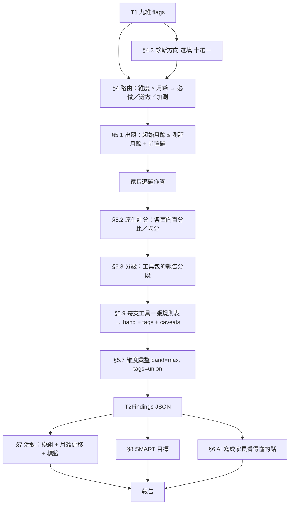

# T2 規格 v2：森心康自建工具包 → 規則引擎 → 報告 → 活動

> **給接手實作的人**：本文件自足，不必回頭讀 v1。§3–§5、§7 是規則本體（實作照抄）；§10 是決定清單，其中標 📞 的是**要帶去問客戶（合作夥伴）的**，問到之前照「暫採」欄做；附錄 A／F 是型別與機器可讀的對應表。凡是「本規格自己的取捨」都標了出來，不要當成客戶說的。
>
> **本文有幾處前後矛盾，程式碼已取一邊實作**（路由的星號、附錄 B.1 與附錄 F 對不上的格子、段界那一個月……）。清單與程式碼現在的行為見 `t2-v2-errata-2026-09-11.md`，整份改版時一併回寫；讀 §4／附錄 B 之前先看它。

## 0. 一頁結論

T2 的題目來源在 2026-09-08 換掉了：`files/` 那 23 份外部量表（ASQ-3、CARS、Conners、SPM、PedsQL、WeeFIM、兒心量表四能區……）**全部不再使用**，改為客戶自建的 **18 支 SXK 工具 + 4 支原文照錄的公開工具**。每支都是同一個引擎：題目依**起始月齡**自動篩選、分數是**百分比**、分段是客戶自承的**內部參考帶**。沒有 DQ、沒有常模、沒有反向計分。

架構不變，仍是三層產出：

| 層 | 是什麼 | 幾種值 |
|---|---|---|
| **判定（band）** | 這份工具對這個維度說「沒事／留意／要關注」 | `clear`／`watch`／`refer`，全站共用 |
| **發現標籤** | 這份工具具體看到什麼 | 受控詞彙，**直接由工具的「面向」或逐題規則產生** |
| **原生數字** | 各面向的達成率／關切率／均分、前置題的答案 | 原樣保存，報告引用、日後建常模用 |

**分級以工具包為準**（2026-09-11 使用者決定）。工具包同一支工具裡有三套分級並存（報告分段、回傳給中控台的五級、中控台再壓的三級），本規格取**報告分段**——它與 09-10 紙本版逐字一致，是最新也是治療師看得到的那一套；其餘兩套視為過期，對照收在附錄 D。

**全部 22 支都由家長操作**（memory `t2-has-no-clinician`）。工具包裡寫「治療師評定」「治療師施測」的那幾支（SXK-ASR、SXK-ADL、SXK-DEV），2026-09-11 使用者決定一律給家長填、帶 caveat，並把這件事列為 📞 要問客戶的第一題。

判斷的事全部由規則做，AI 只負責把判斷講成人話。這一條沿用。

---

## 1. 來源與權威順序

| 東西 | 以誰為準 | 理由 |
|---|---|---|
| 題目文字、選項、起始月齡 | 紙本版 docx（09-10）＝工具包 HTML（09-08）的 `SECS`／`BANKS`／`ITEMS` 常數 | 17 支逐題比對 0 差異；紙本是最新產物 |
| 分級門檻 | 工具包 HTML 的 `LEVELS`／`BANDS`／`band()`（＝紙本「分數解讀」表） | 使用者 2026-09-11 決定；三套裡只有這套與紙本一致 |
| 工具的適用月齡 | 中控台 `TOOLS[].lo/hi`（＝各工具自己的 `showAge` 檢查） | 兩處一致 |
| 維度路由 | 中控台 `DIM`（＝客戶 9/7 docx 的「優先順序」表），**過工具窗口、過本規格的維度對應**後使用 | 客戶的臨床順序，但表裡有列了卻不能用的格子（§4.2） |
| 活動銜接 | `對應活動.docx`（09-09）＝中控台 `MODS`／`DIM_MOD`／`OFFSET` | 客戶的規則；缺每支活動的月齡（§7） |
| 舊原型 `files/` | **只剩 `ACT300` 的 300 個活動名稱與適齡字串**還在用 | 其餘全部作廢 |

**工具包裡那 22 個 HTML 一行都不執行。** 從它們身上只取題庫與門檻；計分在正式站用 TypeScript 重寫、有測試。中控台的 `postMessage` 協定、iframe、個案 JSON 一概不用。

memory `t2-prototype-is-the-authority` 的「原型」自本規格起指這套工具包；`t2-prototype-thresholds-are-self-declared-approximations` 從「部分量表如此」變成「十八支全部如此，而且是刻意的」——每支的免責都寫明「無常模、非診斷依據、不等同對照工具、分數不可換算」。

---

## 2. 目標資料流



`T2Findings` 是 T2 唯一的真相。活動配對讀它、目標讀它、AI 讀它。**任何一個下游不得回頭讀原始答案自己再判一次。**

---

## 3. 工具登錄表

22 支。`id` 是本規格的工具代號（小寫、以工具包代號為準，**不沿用中控台的舊名** `weefim`／`spm25`／`social`——工具包自己的稽核也建議改掉）。月齡窗口是**閉區間**，單位是實足月齡（整數月，不進位）。「家長」欄：工具包對誰填的說法／本規格的決定。

| id | 代號 | 名稱 | 月齡 | 結構 | 作答 | 原生分數 | 餵哪個維度 | 家長 | 進 T2 |
|---|---|---|---|---|---|---|---|---|---|
| `sxk-dev` | SXK-DEV | 分齡發展量表 | 0–72 | 6 領域 × 6 年齡段 × 5 題＝180；一次只出所屬年齡段 30 題 | 通過／未通過／不評 | 通過率（不評不進分母） | MOT、LANG、SOC、ADL、COG（各自的領域） | 工具包：治療師施測，操作類項目應實際觀察 → **家長做**＋`parent_administered_task` | ✅ |
| `sxk-warn` | SXK-WARN | 預警徵象篩查 | 3–84 | 11 時點 × 4 條；一次只出所屬時點 4 條 | 未見異常／陽性，另加語言／社交倒退兩勾 | 陽性數 | 依陽性條目的欄位 | 是 | ⏸ 不路由（§4.6） |
| `mchat-rf` | M-CHAT-R/F | 嬰幼兒自閉症篩查 | 16–30 | 20 題 | 是／否（2、5、12 反向） | 風險題數 | SOC | 是（第二階段訪談不做） | ✅ |
| `sxk-gm` | SXK-GM | 粗大動作 | 6–72 | 5 面向 × 8＝40 | 已經會 2／偶爾會 1／還不會 0 | 達成率 % | MOT | 是＋`parent_administered_task` | ✅ |
| `sxk-soc` | SXK-SOC | 社會能力 | 12–72 | 5 面向 × 8＝40 | 同上 | 達成率 % | SOC | 是＋`parent_administered_task` | ✅ |
| `sxk-lang` | SXK-LANG | 語言能力 | 12–72 | 4 面向 16＋18＋12＋14＝60 | 同上 | 達成率 % | LANG | 是＋`parent_administered_task` | ✅ |
| `sxk-adp` | SXK-ADP | 適應能力 | 18–72 | 5 面向 × 8＝40 | 同上 | 達成率 % | COG | 是＋`parent_administered_task` | ✅ |
| `sxk-voc` | SXK-VOC | 0–3 詞彙量檢核 | 12–42 | 3 面向 × 10＝30 | 同上 | 達成率 % | LANG | 是 | ✅ |
| `sxk-asq` | SXK-ASQ | 三歲綜合篩查 | 36–42 | 5 領域 × 6＝30 | 同上 | 達成率 % | LANG、MOT、COG、SOC（各自的領域） | 是＋`parent_administered_task` | ✅（退役 📞） |
| `sxk-asb` | SXK-ASB | 自閉行為 | 18–180 | 5 向度 12＋12＋11＋12＋10＝57；前置題：能力倒退 | 很少 0／偶爾 1／經常 2／總是 3 | 關切率 % | SOC | 是 | ✅ |
| `sxk-asr` | SXK-ASR | 社交溝通行為 | 24–180 | 4 群組 15 項，每項 4 級**行為錨點**共 60 條；前置題：能力倒退 | 與年齡相符 0～明顯不同 3（**照錨點選**） | 關切率 % | SOC | 工具包：「由治療師觀察後評定，不建議由家長自行填寫」→ **2026-09-11 使用者決定完整給家長填**＋`rater_role_parent`；📞 §10 第 1 題 | ✅ |
| `sxk-ab` | SXK-AB | 注意力及行為觀察 | 36–192 | 6 面向 × 8＝48；前置題：出現場合（複選） | 0–3 | 關切率 % | ATT | 是 | ✅ |
| `sxk-att` | SXK-ATT | 注意力及多動 | 60–180 | 5 情境 × 8＝40；前置題：持續多久 | 0–3 | 關切率 % | ATT | 是 | ✅ |
| `snap-iv` | SNAP-IV | SNAP-IV | 72–216 | 26 題，3 分量表 9／9／8 | 0–3 | 分量表均分 0–3、症狀計數 | ATT（IA、HI）、EMO（OD） | 是（家長版參考點） | ✅ |
| `chexi` | CHEXI | 執行功能 | 48–155 | 24 題，4 副量表 → 2 因素 | 1–5 | 副量表均分、因素相對百分比 | ATT（只出標籤） | 是 | ✅ 只出標籤 |
| `sxk-spa` | SXK-SPa | 感覺處理 2–5 歲 | 24–71 | 7 系統 12＋12＋11＋10＋10＋10＋10＝75；前置題：影響參與（複選） | 0–3 | 關切率 % | SEN | 是 | ✅ |
| `sxk-spb` | SXK-SPb | 感覺處理 5 歲以上 | 60–180 | 同上（8 題改學齡語境） | 0–3 | 關切率 % | SEN | 是 | ✅ |
| `sxk-adl` | SXK-ADL | 生活自理功能 | 30–180 | 4 領域 6＋2＋4＋6＝18 | 七級協助類型 7…1 | 獨立率 % | ADL | 工具包：「建議由治療師評定；家長填時請治療師覆核 4／5 分界」→ **家長填**＋`rater_not_credentialed` | ✅ |
| `sxk-ldp` | SXK-LDP | 學習障礙 小學版 | 72–144 | 5 方面 × 6＝30 | 從未 0～總是 3 | 總分 0–90、各方面 0–18 | LEARN | 是 | ✅ |
| `sxk-lds` | SXK-LDS | 學習障礙 國高中版 | 144–216 | 同上 | 同上 | 同上 | LEARN | 是（可學生自評） | ✅ |
| `sxk-tempa` | SXK-TEMPa | 氣質 1–3 歲 | 12–36 | 9 向度 × 8＝72 | 非常符合 5～非常不符合 0 | 各向度均分 0–5、偏差 | 不分級，只出標籤 | 是 | ✅ 只出標籤 |
| `sxk-tempb` | SXK-TEMPb | 氣質 3–7 歲 | 36–84 | 同上（8 題改語境） | 同上 | 同上 | 同上 | 是 | ✅ 只出標籤 |

**「餵哪個維度」欄比中控台的 `TOOL2DIM` 窄**，這是本規格的取捨。中控台把 SXK-ADP 對到情緒與感覺處理、SXK-SOC 對到日常生活、SXK-ASB 對到語言、SXK-AB／ATT／SNAP／CHEXI 對到學習、SXK-ASQ 對到情緒——那些格子裡工具**沒有對應的面向**，照做會讓一個概念理解偏弱的孩子被判「感覺處理需關注」然後拿到感覺活動。本規格只讓一支工具餵它**有面向可算**的維度；被拿掉的對應列在附錄 C。📞 §10 第 6 題請客戶覆核。

**四支原文照錄的工具**：工具包索引頁自述「院內使用都已涵蓋；若要放進對外收費的產品，M-CHAT 與 SNAP-IV 需先取得授權」。M-CHAT 在 v1 §3.5 已記為核准；SNAP-IV 沒有（📞 §10 第 4 題）。CHEXI 作者免費開放；SXK-WARN 是衛健委文件。

### 3.1 作答值域（實作用）

| 族 | 工具 | 每題的值 | 畫面文字（原文，簡體） |
|---|---|---|---|
| achievement | gm、soc、lang、adp、voc、asq | `0 \| 1 \| 2` | 还不会／偶尔会／已经会 |
| pass | dev | `'pass' \| 'fail' \| 'skip'` | 通过／未通过／不评 |
| independence | adl | `1…7` | 7 完全自己做／6 需要有人在旁／5 需要口头引导／4 需要起头或收尾／3 需要一起做／2 大人做为主／1 完全由大人做（每級有一句定義，畫面要全文顯示） |
| concern | asb、ab、att、spa、spb | `0 \| 1 \| 2 \| 3` | 很少或没有／偶尔／经常／总是 |
| concern-anchored | asr | `0 \| 1 \| 2 \| 3` | 与年龄相符／轻度不同／中度不同／明显不同——**畫面顯示的是該題的四條錨點全文**，選項標籤只當小字 |
| total | ldp、lds | `0 \| 1 \| 2 \| 3` | 从未／偶尔／经常／总是 |
| mean-snap | snap-iv | `0 \| 1 \| 2 \| 3` | 完全没有／有一点点／蛮多的／非常多 |
| mean-chexi | chexi | `1…5` | 完全不正确／不正确／部分正确／正确／完全正确 |
| risk | mchat-rf | `'yes' \| 'no'` | 是／否 |
| positive | warn | `0 \| 1` | 未见异常／阳性 |
| profile | tempa、tempb | `0…5` | 非常不符合 0／不符合 1／有点不符合 2／有点符合 3／符合 4／非常符合 5 |

---

## 4. T1 之後推薦哪些工具

### 4.1 維度層：紅必做、黃選做、綠不做

T1 flag 2（紅）→ 該維度的路由第一支為**必做**；1（黃）→ 同一支列為**選做**（顯示、不擋報告）；0（綠）→ 不做。

### 4.2 路由表：維度 × 月齡 → 有序候選

底稿是中控台的 `DIM`（客戶的優先順序）。客戶的年齡段寫成「歲」，中控台的比對是 `months/12 >= lo && months/12 <= hi`、**取第一個命中的段**，換成月齡閉區間後是：

| 客戶寫法 | 月齡 |
|---|---|
| 0–3 | 0–36 |
| 3–6 | 37–72 |
| 6–12 | 73–144 |
| 12–18 | 145–216 |
| 0–7／7–18（動作） | 0–84／85–216 |
| 1–3（注意力） | 12–36（12 以下無路由） |
| 3–5／5–18（感覺處理） | 37–60／61–216 |
| 6–18 | 73–216 |

套三條修正後成為本規格的路由表（全文見附錄 B）：

1. **過工具窗口**：月齡不在 `[lo, hi]` 的工具從候選拿掉。
2. **過維度對應**：工具對該維度沒有面向可算的（§3、附錄 F），從候選拿掉。
3. **補後備**：附錄 F 裡餵該維度、在窗口內、但 `DIM` 沒列的工具，接在候選**末尾**。

演算法（純函式，`planT2(t1Flags, ageMonth, diagnosis) → T2Plan`）：

```
1. 對每個維度 d，flag ∈ {1, 2}：
   候選(d) = [DIM 表在 ageMonth 所屬段列出的工具，依原順序]
             過濾：在窗口內 且 feeds 含 d 且 producesBand
           ＋ [附錄 F 中 feeds 含 d 且 producesBand 且在窗口內、尚未列入者，依附錄 F 的順序]
   只出標籤的工具（chexi、tempa、tempb）另列為 extras(d)：在窗口內就列，永遠是「選做」
2. 若 候選(d) 為空 → plan.noTool 加入 d；跳過
3. 星號(d) = 候選(d)[0]
   flag 2 → role 'required'；flag 1 → role 'optional'
   候選(d)[1..2] → role 'followup'（最多兩支；顯示條件見下）
4. 診斷方向（§4.3）：DIS[疾病][段] 的工具，過窗口，全部 role 'required'，forDimensions 依附錄 F
5. 去重：同一支工具出現在多個維度 → 一筆，role 取最強（required > optional > followup），forDimensions 取聯集
6. 每支估算 askedCount(tool, ageMonth)（§4.4），plan 回傳 required／optional／followup 三組的題數合計
```

**加測（followup）的顯示條件**：星號做完且該維度 band ∈ {watch, refer} 才顯示，文案「再花約 N 題可以更精確」。星號判 `clear` 不主動推。

**每個維度最多 3 支**（星號＋兩支加測）是本規格自己定的上限；客戶中控台的上限是「每路由六支」，那是給治療師看的。

### 4.3 診斷方向（選填，十選一）

問法是「**醫師是否已告知診斷方向**」，不是「你覺得孩子有什麼問題」。選項與中控台 `DIS` 一致，十種：腦癱、發展遲緩、智力障礙、學習障礙、多動症、語言障礙、情緒障礙、心理疾病、抽動症、自閉症。**單選**——v1 §3.1 擔心的「複選炸掉題量」在這裡不存在。

選了之後，把 `DIS[疾病][年齡段]` 的工具（最多 6 支，過窗口）全部提為必做，並把該疾病的「功能處理順序」帶進報告當維度排序（附錄 B.2）。三格是空的（學習障礙／多動症／抽動症的 0–36 個月）：選了就等於沒選，不擋流程。

沒填不得阻擋流程，報告裡不得出現「未提供診斷資訊」這種像缺漏的字樣。`T2Findings.diagnosisDirection` 存 `null`。

### 4.4 題量

題目依起始月齡篩選，**每個孩子的題數可以精確算出來**：

```
askedCount(tool, m) =
  achievement / concern 族：Σ 面向 items.filter(it => it.m <= m).length
  dev：30（所屬年齡段）      warn：4      mchat-rf：20
  asb：57    asr：15    snap-iv：26    chexi：24    ldp／lds：30    tempa／tempb：72
```

各工具在代表月齡的適用題數（實作時用程式重算一次當測試）：

| 工具 | 12 | 18 | 24 | 30 | 36 | 42 | 48 | 60 | 72 | 96＋ |
|---|---|---|---|---|---|---|---|---|---|---|
| sxk-gm | 22 | 28 | 31 | 33 | 35 | 37 | 40 | 40 | 40 | — |
| sxk-soc | 18 | 20 | 23 | 26 | 32 | 35 | 36 | 40 | 40 | — |
| sxk-lang | 8 | 18 | 23 | 26 | 33 | 38 | 49 | 60 | 60 | — |
| sxk-adp | — | 18 | 21 | 28 | 31 | 37 | 37 | 40 | 40 | — |
| sxk-voc | 4 | 17 | 24 | 29 | 30 | 30 | — | — | — | — |
| sxk-asq | — | — | — | — | 30 | 30 | — | — | — | — |
| sxk-adl | — | — | — | 13 | 17 | 18 | 18 | 18 | 18 | 18 |
| sxk-att | — | — | — | — | — | — | — | 40 | 40 | 40 |
| sxk-ab | — | — | — | — | 29 | 29 | 41 | 48 | 48 | 48 |
| sxk-spa | — | — | 75 | 75 | 75 | 75 | 75 | 75 | — | — |
| sxk-spb | — | — | — | — | — | — | — | 75 | 75 | 75 |

一個 48 個月、T1 紅了語言與注意力、黃了感覺處理的孩子：必做 sxk-lang 49 ＋ sxk-ab 41 ＝ **90 題**，選做 sxk-spa 75。最重的單支是 sxk-lang 60 題與兩支感覺量表 75 題。

畫面上要在家長開始之前顯示「需要完成 N 份、約 M 題」，必做、選做、加測分開算。

### 4.5 年齡覆蓋的洞

客戶的路由表在 6 歲以上仍有空格，而且有兩格**列了工具卻打不開**：

| 維度 | `DIM` 列的 | 實際 |
|---|---|---|
| 語言 73–144 | SXK-DEV | 空（DEV 只到 72 個月） |
| 語言 145–216 | 沒有這一列 | 空 |
| 日常生活 73–216 | SXK-DEV | 只剩後備 sxk-adl |
| 認知 73–216 | SXK-SPb | 空（感覺量表沒有認知面向） |
| 動作 85–216 | SXK-SPb、SXK-ADL | 只剩 sxk-adl 的「移動與轉位」4 項 |
| 情緒 0–72 | 氣質量表、ADP、SOC、ASR、ASB、ADL | 空（氣質不分級；其餘沒有情緒面向）——只有 snap-iv 的 OD 在 72 個月起 |

**決定：空格明寫。** 被 T1 標記但在該月齡沒有任何會出 band 的工具的維度，`DimensionFinding.band = 'no_tool'`，報告寫「這個年齡目前沒有適用的深度評估工具，建議直接預約專家」並導向四種服務。所有被標記的維度都是 `no_tool` 時，**不顯示 T2 入口**（家長付費前就要知道）。📞 §10 第 5 題。

### 4.6 三支特別處理的

- **`sxk-asr` 完整給家長填**（2026-09-11 使用者決定）。工具包三處寫「由治療師觀察後評定，不建議由家長自行填寫」，但同一份紙本的「評估方式」段又寫「由最了解孩子日常表現的人填寫，建議家長與老師各填一份」，表單的填表人身份也列著父親／母親／主要照顧者——工具包自己沒有定論。逐項讀完 60 條錨點：15 項裡 13 項是家長每天看得到的行為（親近人、模仿、拉手帶路、踮腳甩手、轉輪子排隊、換活動的反應……），舊 CARS「對檢查者的反應」「使勁打擾他」那種評分者依賴的用語已經不在；第 14 項（能力發展的均勻度）與第 15 項（整體印象）要拿同齡孩子當尺，家長答得出粗略版。配套：**每題顯示四條錨點全文**（選項只給「輕度不同」四個字家長答不了）；第 4 項「仿说」「功能性语言」加白話註解；第 15 項加一句「可以拿幼兒園同學或親戚的孩子當比較」；結果帶 caveat `rater_role_parent`。在路由裡它照客戶的順序排在 sxk-asb 之後（社交 37–72：ASB › ASR › SOC……），也就是**加測**——只有 ASB 判留意或關注時才多問這 15 題。判定規則不另開特例，與其他工具一樣取 max。📞 §10 第 1 題。
- **`sxk-warn` 不路由。** 它是政府的紅旗初篩，一次只有 4 條，工具包把它定位成「廣篩：先跑這支定方向」——在 A 裡這個位置是 T1，重複做沒有意義。規則表仍寫（§5.9），日後要當「T1 之外的第二道紅旗」加進來時不必重做。📞 §10 第 8 題。
- **`sxk-asq` 退役待定。** 工具包作者自己建議退役（只涵蓋 36–42 個月，30 題裡 14 題與 SXK-DEV 重複）。本規格**先留在路由裡**（客戶的優先順序表把它排在認知 0–36 與社交 0–36 的第一支）；退役時只需從路由表拿掉，規則表不動。📞 §10 第 3 題。

---

## 5. 規則引擎

### 5.1 出題

- **起始月齡**：面向型工具每題帶 `m`，只出 `m ≤ 測評月齡` 的題；未到年齡的題不出、不計滿分。這是工具包的規則，紙本版亦如此。
- **年齡段型**：`sxk-dev` 六段（0–6／7–12／13–24／25–36／37–48／49–72）只出所屬那一段 30 題；`sxk-warn` 十一時點（3／6／8／12／18／24／30／36／48／60／72）取「≤ 月齡的最大時點」出 4 條。
- **前置題**先於題目出現，答案進 `ToolResult.pre`，不計分：

| 工具 | `pre` 鍵與值 | 畫面問法（原文） | 對結果的影響 |
|---|---|---|---|
| `sxk-asb`、`sxk-asr` | `regression: 'none' \| 'language' \| 'social'` | 孩子有没有出现过能力倒退？（没有／语言能力出现倒退／社交能力出现倒退） | ≠ none → band 直接 `refer`，caveat `regression_reported` |
| `sxk-att` | `duration: 'lt3m' \| '3to6m' \| 'gt6m' \| 'always'` | 这些表现出现多久了？ | `lt3m`／`3to6m` → caveat `recent_onset`；不改 band |
| `sxk-ab` | `settings: ('home' \| 'school' \| 'other')[]` | 这些表现出现在哪些场合？（複選） | 長度 ≤ 1 → caveat `single_setting`；不改 band |
| `sxk-spa`、`sxk-spb` | `impact: ('none' \| 'adl' \| 'group' \| 'play')[]` | 这些反应有没有影响到日常参与？（`none` 與其餘互斥） | `none` → caveat `no_functional_impact`；其餘各出標籤 `sen.impact_adl`／`impact_group`／`impact_play`（只進報告）；不改 band |
| `mchat-rf` | `concern: boolean` | 医护人员或家长是否对儿童患上自闭症谱系障碍有担心？ | 低風險且 `true` → `watch` |
| `sxk-warn` | `regression: ('language' \| 'social')[]` | 语言功能／社会交往能力有无障碍或倒退 | 非空 → 初篩異常 |

- **填表人**：每支工具記 `rater: 'father' | 'mother' | 'caregiver' | 'teacher' | 'other'`（工具包的「填表人身份」，去掉「治療師」）。用途只有兩個：caveat 文案、日後建常模時分層。不擋流程。
- **完整性**：面向型工具要求本次出的題全答。缺答一律回 `incomplete`，**不以 0 補**。`sxk-dev` 的「不評」不是缺答，它合法地不進分母；一個領域五題全「不評」時該領域 `pct = null`、該維度不出 band。
- **重做**：同一支工具可重做，每次是一筆新的 `ToolResult`；`T2Findings` 只取每支**最新且完整**的一筆。

### 5.2 原生計分

`pct` 一律 `Math.round(x × 100)`（JS 的 `Math.round`，.5 進位），**先四捨五入再比門檻**——工具包如此。

| 族 | 工具 | 面向分 | 總分 |
|---|---|---|---|
| achievement | gm、soc、lang、adp、voc、asq | `raw = Σ答案`，`max = n×2`，`pct = round(raw/max×100)`；`n < MIN_ITEMS(3)` 的面向 `scored=false`（算得出、不單獨判讀、不出標籤） | 全部適用題同法 |
| pass | dev | 每領域 `pass/(pass+fail)`；分母 0 → `null` | 同法跨領域（只供報告） |
| independence | adl | `pct = round((raw − n) ÷ (n×6) × 100)`；`MIN_ITEMS(2)` | 同法 |
| concern | asb、asr、ab、att、spa、spb | `pct = round(raw ÷ (n×3) × 100)`；另記 `hi = 答 ≥2 的題數` | 同法 |
| total | ldp、lds | 各方面 `raw` 0–18 | `total` 0–90 |
| mean-snap | snap-iv | 各分量表 `ari = Σ ÷ n`（0–3，保留兩位）；`sx = 答 ≥2 的題數` | — |
| mean-chexi | chexi | 各副量表 `mean = Σ ÷ n`（1–5）；因素 `pct = round((Σ − n) ÷ (4n) × 100)`，F1＝工作記憶（9 題）＋計劃力（4）、F2＝抑制力（6）＋調節力（5） | — |
| risk | mchat-rf | 題 2、5、12 答 `yes` 算風險，其餘答 `no` 算風險；`riskItems = 風險題號[]` | `risk = riskItems.length` |
| positive | warn | `positives = 陽性條目索引[]` | `count` |
| profile | tempa、tempb | 各向度 `mean = Σ ÷ 8`，`dev = mean − 2.5`（8 題全部朝「hi」端敘述，沒有反向題） | — |

### 5.3 分級：各工具的分段（＝工具包報告分段＝紙本）

`tier` 是 1–4 的整數，1 最好。各工具的 key 是**內部名稱**，家長端一個字都不能直接出現（「落後」「明顯」都是《家长报告用语对照表》的禁字），家長看到的永遠是 band 對應的三句話（`src/utils/statusWording.ts`）。

| 族 | 工具 | tier 1 | tier 2 | tier 3 | tier 4 |
|---|---|---|---|---|---|
| achievement | gm、soc、lang、adp、voc、asq | pct ≥85 未見明顯問題 | 70–84 輕微落後 | 55–69 中度落後 | ≤54 明顯落後 |
| pass | dev | ≥90 達成良好 | 75–89 大致達成 | 60–74 部分未達成 | ≤59 明顯落後 |
| independence | adl | ≥72 獨立性良好 | 58–71 少數活動需協助 | 45–57 部分活動需協助 | ≤44 多數活動需協助 |
| concern | asr | 0–20 未見明顯 | 21–29 輕微 | 30–38 中度 | ≥39 明顯 |
| concern | asb | 0–22 | 23–31 | 32–40 | ≥41 |
| concern | att | 0–25 | 26–33 | 34–42 | ≥43 |
| concern | ab | 0–33 | 34–41 | 42–50 | ≥51 |
| concern | spa、spb | 0–28 | 29–36 | 37–45 | ≥46 |
| total | ldp、lds | total 0–9 未見明顯 | 10–19 輕微 | 20–29 中等 | ≥30 顯著；各方面 0–4／5–8／9–12／13–18 |
| mean-snap | snap-iv | 各分量表 ari ≤1.2 低於參考點 | 1.2 < ari ≤ 1.8 高於關注參考點 | ari > 1.8 高於診斷參考點 | — |
| risk | mchat-rf | 0–2 低風險 | 3–7 中等風險 | 8–20 高風險 | — |
| positive | warn | 0 且無倒退：初篩未見異常 | — | 任一陽性或任一倒退：初篩異常 | — |
| mean-chexi | chexi | 因素 pct ≤33 相對較低 | 34–66 中等 | ≥67 相對偏高 | — |
| profile | tempa、tempb | \|dev\| < 0.42 兩端之間 | 0.42 ≤ \|dev\| < 1.0 稍偏 | \|dev\| ≥ 1.0 明顯偏向 | — |

面向也用同一張表分級（`sectionTier`）。關切率族六支切分不一致（同樣 30% 在 att 是 tier 2、在 ab 是 tier 1）——工具包自己的稽核已指出並提議統一成 25／45。**本規格照各支原值**（📞 §10 第 2 題）。

### 5.4 tier → band

```ts
type Band = 'clear' | 'watch' | 'refer';
```

| tier | band | 另外 |
|---|---|---|
| 1 | `clear` | — |
| 2 | `watch` | — |
| 3 | `refer` | — |
| 4 | `refer` | 標籤 `severity.severe` |

工具包自己的 `FREQ` 佐證這條線的位置：tier 2 是「居家練習為主，暫不需排課」，tier 3 起是「建議每週 1–2 次」——留意與要關注的分界就在 2／3 之間。

例外：

- **`snap-iv`**：IA、HI 取較差者餵 ATT；OD 餵 EMO。tier 1→`clear`、2→`watch`、3→`refer`（OD 一視同仁，理由：工具的 `level()` 對三個分量表用同一組參考點；本規格自己的取捨，見 §10.2 第 3 項）。
- **`mchat-rf`**：低風險→`clear`（`concern` 為真→`watch`）；中等風險→`watch`＋caveat `follow_up_not_done`，報告明講「建議由專家做第二階段訪談」並導向預約；高風險→`refer`。
- **`warn`**：初篩異常→`refer`（官方規範是「任一陽性即轉診複篩」；中控台回傳的「輕度」與它自己的判定文字矛盾，不採）。
- **`chexi`**：**不出 band**。紙本與 HTML 都寫「本檔不套用任何自造切分值，判讀須對照原作者發表的常模」。因素「相對偏高」時出標籤，另標 caveat `descriptive_only`。
- **`tempa`／`tempb`**：**不出 band**，恆不影響維度判定。「明顯偏向」出標籤，「稍偏」只進報告。
- **前置題「能力倒退」**（asb、asr）：不論分數直接 `refer`。
- **多維度工具**（dev、asq、snap）：band 按**該維度對應的面向**分別算，不用總分。`sxk-dev` 一個領域只有 5 題，通過 4 題＝80%＝tier 2；工具包的報告矩陣就是這樣判的，照做，但一律標 caveat `few_items`。

### 5.5 發現標籤（受控詞彙 v2）

標籤是**寫在程式碼裡的常數**（`src/t2/findingTags.ts`），格式 `<維度小寫>.<標的>`。★ 表示「配活動」（`Activity.targets` 只認這些），其餘「只進報告」。

| 維度 | 標籤 | 產出它的面向／規則 |
|---|---|---|
| lang | ★comprehension、★expression、★expression_below_comprehension、★vocabulary_size、★articulation、★pragmatics | lang RC／EX／AR／PR；voc V1／V2／V3；asq CO；dev LANG；adl CC 前兩項；asb LA；mchat 2、18 |
| soc | ★joint_attention、★eye_contact、★imitation、★social_initiation、★emotion_reciprocity、★pretend_play、response_to_name、stereotyped_behavior | soc S1–S4；mchat 逐題；asb RE／BO 逐題；asr 1、2、9、10；asq PE；dev SOC |
| emo | ★regulation、adaptability_low、intensity_high、mood_negative、regularity_low、slow_to_warm、activity_high | soc S5；ab OD；snap OD；chexi 調節力；asb SH；asr 3、11、12、13；temp 九向度 |
| att | ★inattention、★hyperactivity、★impulsivity、★working_memory、★inhibition、★organization | ab SU／DI／IM／HY／EF；att 五情境；snap IA／HI；chexi；ldp 注意力方面；temp 注意分散度 |
| mot | ★postural、★locomotion、★balance、★ball_skills、★fine_motor | gm P1–P5；dev MOT／FM；asq GM／FM；adp A2；adl MO；asb BO 7；mchat 4、13、20 |
| sen | ★tactile、★vestibular、★body_awareness、★auditory、★visual、★oral、★regulation、threshold_low、impact_adl、impact_group、impact_play | spa／spb 七系統與前置題；asb SE 逐題；asr 6、7、8；mchat 5、12；temp 反應閾 |
| adl | ★feeding、★dressing、★toileting、★hygiene、★routines | adl 逐項；adp A5；asq PE 前三項；dev ADL；asb SH 4、5 |
| cog | ★visual_attention、★problem_solving、★concepts | adp A1／A3／A4；asq PS；dev COG |
| learn | ★reading、★writing、★number、★phonological、★task_persistence | ldp／lds 五方面；temp 堅持度；att HW |
| severity | severe | 任何工具的 tier 4 |

**觸發規則**：

- 面向級：該面向 `scored=true` 且 `sectionTier ≥ 2`。
- 逐題級（§5.9 有逐題表的工具）：concern 族該題答 `≥ 2`；achievement 族該題答 `≤ 1`；mchat 該題算風險；adl 該題 `≤ 4`（大人動手了）。
- `lang.expression_below_comprehension`：`RC.pct − EX.pct ≥ 15` 且 EX 的 `sectionTier ≥ 2`（voc 用 V1／V2 同法）。
- 氣質：`dev ≥ 1.0`（hi 端）或 `dev ≤ −1.0`（lo 端），對照 §5.9 的向度表。

比 v1 多的：`lang.articulation`、`lang.pragmatics`、`soc.emotion_reciprocity`、`soc.pretend_play`、`att.organization`、`sen.oral`、`sen.regulation`、`mot.postural`、`cog.visual_attention`。少的：`sen.planning`。`mot.fine_motor` 現在有三個來源（dev FM、asq FM、adp A2 物體操作）——adp A2 的八題是抓握、換手、捏取、疊積木、翻書、串珠，是手的動作控制，貼 `mot.fine_motor` 站得住（與 v1 對 `adaptdq` 的判斷不同，因為題目換了）。

每個維度不超過 10 個。

### 5.6 Caveats（受控值 v2）

| 值 | 觸發 | 報告怎麼講（給模板與 AI 的固定句） |
|---|---|---|
| `incomplete` | 本次出的題沒有全答 | 「這份問卷有 N 題沒有作答，結果可能偏保守」 |
| `age_out_of_window` | 測評月齡在工具窗口外——**規則引擎拒算，不出結果**；只會出現在舊紀錄被新窗口重讀時 | 「這份結果是在孩子 N 個月時做的，超出這份工具的適用範圍，僅供參考」 |
| `unsourced_threshold` | 這支工具的分段是客戶自承的內部參考帶。**18 支自建工具一律帶**；`snap-iv`（Bussing 2008）與 `mchat-rf`（官方）不帶 | 「這份工具的分段是森心康依臨床經驗訂定的參考帶，尚未建立常模」 |
| `parent_report` | 家長問卷（全部都是） | 不單獨成句 |
| `parent_administered_task` | 施測項目由家長操作——dev、gm、soc、lang、adp、voc、asq | 「這份是由家長觀察孩子實際做做看之後記錄的」 |
| `rater_not_credentialed` | `adl` 由家長評定，未經治療師覆核 4／5 分界 | 「協助程度的判斷由家長自行拿捏，不同人評分會有差異」 |
| `rater_role_parent` | `asr` 由家長填答（原設計由治療師觀察後評定） | 「這份原本設計由專業人員觀察後評定，此次由家長依日常觀察填答」 |
| `few_items` | 用來判級的面向適用題數 ≤ 6 | 「這一項只依 N 題判斷，宜與其他結果合併看」 |
| `follow_up_not_done` | `mchat-rf` 3–7 分，第二階段訪談未做 | 「建議由專業人員做進一步訪談再確認」 |
| `regression_reported` | `asb`／`asr` 前置題答有倒退 | 「家長回報孩子出現能力倒退，建議儘快安排專業評估」 |
| `recent_onset` | `att` 前置題 <6 個月 | 「這些表現出現不到六個月，先留意最近的環境變化」 |
| `single_setting` | `ab` 前置題只勾一個場合 | 「目前只在一個場合觀察到，建議也請老師觀察」 |
| `no_functional_impact` | `spa`／`spb` 前置題勾「無」 | 「家長認為這些反應尚未影響日常參與」 |
| `descriptive_only` | `chexi`：只有相對百分比，無切分 | 「這份只呈現相對程度，不做分級」 |
| `hearing_check_first` | `lang`／`voc` 判 `refer`，或 `mchat-rf` 第 2 題答「是」 | 「建議先做聽力檢查」 |
| `narrow_window` | `sxk-asq` | 「這份只涵蓋三歲前後，不宜跨年齡比較」 |
| `safety_concern` | `asb` SH 第 8 項「出现自伤行为」答 ≥2 | 「有自我傷害的行為時，請儘快聯繫專業人員」——**報告置頂** |

拿掉的 v1 值：`basal_not_established`、`known_scoring_defect_corrected`、`license_pending`。

### 5.7 維度彙整

```ts
interface DimensionFinding {
  dimensionId: DimensionCode;              // 'COG' | 'LANG' | 'SOC' | 'EMO' | 'ATT' | 'MOT' | 'SEN' | 'ADL' | 'LEARN'
  band: Band | 'partial' | 'not_assessed' | 'no_tool';
  drivenBy: ToolId | null;                 // 哪一支把 band 推到這裡
  tags: FindingTag[];                      // 各工具 tags 的聯集（去重，保序：依 drivenBy 先）
  caveats: Caveat[];                       // 聯集
  tools: ToolId[];                         // 這個維度做了哪幾支（含只出標籤的）
  t1Flag: 0 | 1 | 2;
}
```

- `band = max(各工具對此維度的 band)`（`refer` > `watch` > `clear`）。兩支一支說沒事一支說要關注，漏掉後者比多看一次糟。
- **星號沒做完 → `'partial'`**，不用加測工具的結果代表整個維度。
- **T1 黃、家長沒做選做 → `'not_assessed'`**，報告照 T1 的判定講。
- **窗口內沒有任何會出 band 的工具 → `'no_tool'`**（§4.5）。
- 四種非 band 值與 `clear` 必須分得開：塌成同一個值就是「沒做完」被讀成「沒事」。
- `drivenBy` 一定要記；家長會問「哪一份說的」。同 band 時取先做完的那支。
- T1 綠的維度也可能收到標籤（例如氣質量表餵 EMO 的 `emo.slow_to_warm`）：`band = 'clear'`，標籤照收，只進報告。

### 5.8 T2Findings

```ts
interface T2Findings {
  version: 3;                              // v1 規格是 2
  toolkitVersion: 'kit-20260908';
  rulesVersion: string;                    // 'v2-2026-09-11'；門檻改了就要換，舊報告記著舊版本
  child: { assessedAgeMonth: number; sex?: 'boy' | 'girl' };
  t1: Record<DimensionCode, 0 | 1 | 2>;
  diagnosisDirection: DiagnosisDirection | null;
  dimensions: DimensionFinding[];          // 九個都在，含 clear
  toolResults: ToolResult[];               // 每支最新且完整的一筆
  computedAt: string;
}

interface ToolResult {
  toolId: ToolId;
  toolkitVersion: 'kit-20260908';
  assessedAgeMonth: number;
  rater: 'father' | 'mother' | 'caregiver' | 'teacher' | 'other';
  askedCount: number; answeredCount: number;
  pre: Record<string, string | string[] | boolean>;
  answers: Record<string, number | string>;         // 題 key → 值（§3.1）；dev 的 key 是 `${band}.${domain}.${idx}`
  sections: Record<string, SectionStat>;
  overall: SectionStat;
  native: Record<string, number | string | number[] | string[] | null>;
  computedAt: string;
}

interface SectionStat {
  n: number; raw: number; max: number;
  pct: number | null;                      // 已四捨五入；dev 分母 0 或 chexi/snap 不用時為 null
  tier: 1 | 2 | 3 | 4 | null;
  scored: boolean;                         // n ≥ MIN_ITEMS
}
```

### 5.9 各工具規則表

每支一張。`source` 一律指向工具包檔名與常數名（例如 `SXK-GM.html LEVELS`），紙本版頁面為副本。逐題表裡的題號是**該面向內的序號（從 1 起）**，與紙本一致。

| 工具 | band 來源 | tags | 固定 caveats |
|---|---|---|---|
| `sxk-dev` | 每領域通過率 → MOT←MOT、LANG←LANG、SOC←SOC、ADL←ADL、COG←COG；FM 領域不出 band | 領域 tier ≥2：MOT→`mot.locomotion`、FM→`mot.fine_motor`、LANG→`lang.comprehension`＋`lang.expression`、SOC→`soc.social_initiation`、ADL→`adl.routines`、COG→`cog.problem_solving` | `unsourced_threshold`、`parent_administered_task`、`few_items` |
| `sxk-warn` | 初篩異常→`refer`；維度依陽性條目：每時點第 1 條→LANG、第 2 條→SOC、第 3 條→MOT（`mot.fine_motor`）、第 4 條→MOT（`mot.locomotion`）；語言倒退勾→LANG、社交倒退勾→SOC | 同左 | 無 |
| `mchat-rf` | 風險數 → SOC（§5.4） | 風險題：1、16、19→`soc.joint_attention`；6、7、9、17→`soc.joint_attention`；8、11→`soc.social_initiation`；10→`soc.response_to_name`；14→`soc.eye_contact`；15→`soc.imitation`；3→`soc.pretend_play`；18→`lang.comprehension`；2→`lang.comprehension`＋`hearing_check_first`；4、13、20→`mot.locomotion`；5→`sen.visual`；12→`sen.auditory` | `follow_up_not_done`（3–7 分） |
| `sxk-gm` | 總達成率 → MOT | P1 臥位與翻身、P2 坐姿控制、P3 爬行與站立→`mot.postural`；P4 走跑跳→`mot.locomotion`；P5 平衡與協調→`mot.balance`；P5 第 3 項「能踢固定的球」或第 6 項「能接住拋來的大球」答 ≤1→另加 `mot.ball_skills` | `unsourced_threshold`、`parent_administered_task` |
| `sxk-soc` | 總達成率 → SOC | S1 人際注意→`soc.joint_attention`＋`soc.eye_contact`；S2 情緒互動→`soc.emotion_reciprocity`；S3 模仿與學習→`soc.imitation`；S4 遊戲參與→`soc.social_initiation`；S5 規則與自我→`emo.regulation`（只出標籤，不餵 EMO 的 band） | `unsourced_threshold`、`parent_administered_task` |
| `sxk-lang` | 總達成率 → LANG | RC→`lang.comprehension`；EX→`lang.expression`；AR→`lang.articulation`；PR→`lang.pragmatics`；RC−EX ≥15 且 EX tier ≥2→`lang.expression_below_comprehension` | `unsourced_threshold`、`parent_administered_task`；`refer` 時加 `hearing_check_first` |
| `sxk-adp` | 總達成率 → COG | A1 視覺與追蹤→`cog.visual_attention`；A2 物體操作→`mot.fine_motor`（只出標籤）；A3 問題解決→`cog.problem_solving`；A4 概念理解→`cog.concepts`；A5 生活應用→`adl.routines`（只出標籤） | `unsourced_threshold`、`parent_administered_task` |
| `sxk-voc` | 總達成率 → LANG | V1→`lang.comprehension`；V2→`lang.expression`；V3→`lang.vocabulary_size`；V1−V2 ≥15 且 V2 tier ≥2→`lang.expression_below_comprehension` | `unsourced_threshold`；`refer` 時加 `hearing_check_first` |
| `sxk-asq` | 每領域達成率 → CO→LANG、GM→MOT、PS→COG、PE→SOC；FM 不出 band | CO→`lang.expression`；GM→`mot.locomotion`；FM→`mot.fine_motor`；PS→`cog.problem_solving`；PE 第 1 項（用湯匙）→`adl.feeding`、第 2 項（大小便表示）→`adl.toileting`、第 3 項（脫衣物）→`adl.dressing`，第 4–6 項→`soc.social_initiation` | `unsourced_threshold`、`parent_administered_task`、`few_items`、`narrow_window` |
| `sxk-asb` | 總關切率 → SOC；前置題有倒退→`refer` | 逐題（答 ≥2）——SE：1、10、12→`sen.auditory`；2、5、8、9→`sen.tactile`；3、6、7→`sen.visual`；4、11→`sen.oral`。RE：1、6、7、10→`soc.social_initiation`；2→`soc.eye_contact`；3→`soc.response_to_name`；4、8→`soc.joint_attention`；5、9、12→`soc.emotion_reciprocity`；11→`soc.imitation`。BO：1、2、3、5、6、10→`soc.stereotyped_behavior`；7→`mot.balance`；11→`soc.imitation`；4、8、9 不出標籤。LA：1→`lang.expression`；9→`lang.comprehension`；其餘→`lang.pragmatics`。SH：1、10→`emo.adaptability_low`；2→`sen.oral`；3→`emo.regularity_low`；4→`adl.toileting`；5→`adl.dressing`；7→`emo.regulation`；9→`soc.stereotyped_behavior`；6 不出標籤；8→caveat `safety_concern` | `unsourced_threshold`；`regression_reported`；`safety_concern` |
| `sxk-asr` | 總關切率 → SOC；前置題有倒退→`refer` | 逐題（答 ≥2）：1→`soc.social_initiation`；2→`soc.imitation`；3→`emo.regulation`；4→`lang.expression`＋`lang.pragmatics`；5→`lang.pragmatics`；6→`sen.visual`＋`soc.eye_contact`；7→`sen.auditory`；8→`sen.tactile`＋`sen.oral`；9、10→`soc.stereotyped_behavior`；11→`emo.adaptability_low`；12→`emo.activity_high`（工具沒有分偏高／偏低側，一律出）；13→`emo.regulation`；14、15 不出標籤 | `unsourced_threshold`、`rater_role_parent`；`regression_reported` |
| `sxk-ab` | 總關切率 → ATT | SU 持續專注、DI 抗干擾→`att.inattention`；IM 衝動控制→`att.impulsivity`；HY 活動量→`att.hyperactivity`；EF 組織與執行→`att.organization`；OD 對立與情緒→`emo.regulation`（只出標籤） | `unsourced_threshold`；`single_setting` |
| `sxk-att` | 總關切率 → ATT | CL 課堂、HM 居家→`att.inattention`；HW 作業→`att.inattention`＋`learn.task_persistence`；IP 人際→`att.impulsivity`；SM 自我管理→`att.organization`；`native.hotSettings = tier ≥2 的情境數` | `unsourced_threshold`；`recent_onset` |
| `snap-iv` | max(IA, HI) → ATT；OD → EMO | IA→`att.inattention`；HI→`att.hyperactivity`＋`att.impulsivity`；OD→`emo.regulation`；`native.symptomCounts` | 無 |
| `chexi` | **不出 band** | 因素 pct ≥67：F1→`att.working_memory`（計劃力副量表 mean ≥4 另加 `att.organization`）；F2→`att.inhibition`（調節力 mean ≥4 另加 `emo.regulation`） | `descriptive_only` |
| `sxk-spa`／`spb` | 總關切率 → SEN | TA→`sen.tactile`；VE→`sen.vestibular`；PR 本體覺→`sen.body_awareness`；AU→`sen.auditory`；VI→`sen.visual`；OR 口腔與進食→`sen.oral`；RG 調節與專注→`sen.regulation`；前置題→`sen.impact_*` | `unsourced_threshold`；`no_functional_impact` |
| `sxk-adl` | 總獨立率 → ADL | 逐項（答 ≤4）——SC：1 進食→`adl.feeding`；2 穿脫上衣、3 穿脫褲子與鞋襪→`adl.dressing`；4 梳洗整理、6 洗澡→`adl.hygiene`；5 如廁動作→`adl.toileting`。SP：1、2→`adl.toileting`。MO：1–4→`mot.locomotion`（只出標籤）。CC：1 理解指令→`lang.comprehension`、2 表達需求→`lang.expression`、6 記住並完成交代的事→`adl.routines`（均只出標籤）；3、4、5 不出標籤 | `unsourced_threshold`、`rater_not_credentialed`；括約肌領域 `few_items` |
| `sxk-ldp`／`lds` | 總分 → LEARN | 各方面 tier ≥2：閱讀→`learn.reading`；數學→`learn.number`；書寫→`learn.writing`；注意力→`att.inattention`（只出標籤）；語言處理→`learn.phonological` | `unsourced_threshold` |
| `sxk-tempa`／`tempb` | **不出 band** | `dev ≥ 1.0`：D1 活動量→`emo.activity_high`；D2 規律性→`emo.regularity_low`；D3 趨避性→`emo.slow_to_warm`；D4 適應度→`emo.adaptability_low`；D5 反應強度→`emo.intensity_high`；D6 情緒本質→`emo.mood_negative`；D8 注意分散度→`att.inattention`；D9 反應閾→`sen.threshold_low`。`dev ≤ −1.0`：D7 堅持度→`learn.task_persistence`。其餘方向與「稍偏」只進報告的氣質段落（`native.profile`） | 無 |

---

## 6. AI 報告：AI 只寫字，不判斷

### 6.1 兩階段

```
T2Findings（規則產出，確定的）＋ §7 已選好的活動 ＋ §8 已算好的目標 ──→ LLM ──→ 家長看的段落（JSON schema）
                                                                      ↑
                                                              系統提示：只能解釋，不能改判定
```

正式站已有這條管線（`server.ts` 的 `generateReportJSON`：Qwen → Doubao → DashScope 三段備援、JSON 輸出、失敗退模板）。T2 沿用，換提示與 schema。

### 6.2 AI 可以做與不可以做

| 可以 | 不可以 |
|---|---|
| 把 `lang.expression_below_comprehension` 寫成「孩子聽得懂的比說得出的多」 | 把 `watch` 寫成「輕度遲緩」或任何診斷名 |
| 解釋為什麼選了這四支活動（用 §7 給的 `reason`） | 換掉任何一支活動、加任何一支 |
| 把 caveats 寫進去（§5.6 的固定句可改寫但不可略） | 省略 caveats |
| 用「建議諮詢專業人員」收尾 | 提任何儀器、療程、藥物 |
| 引用原生數字（「達成率 78%，落在需要留意的區間」） | 自己算或改任何數字；出現 tier 的內部名稱 |
| 用四支原文照錄工具的官方名稱（M-CHAT-R/F、SNAP-IV、CHEXI、預警徵象篩查表） | 提到被替換掉的量表名（ASQ、丹佛／Denver、CARS、ABC、Conners、SPM、PedsQL、WeeFIM、FIM、兒心量表、TTQ／TTS／MCTQ／BSQ、CDI） |

### 6.3 輸出 schema

```ts
interface T2ReportProse {
  overview: string;                       // 60–120 字，只講 band 分布；有診斷方向時依功能處理順序排
  perDimension: Array<{
    dimensionId: DimensionCode;
    whatWeSaw: string;                    // 由 tags 展開，80–150 字
    whyItMatters: string;                 // 60–100 字，不得出現診斷名
    caveats: string[];                    // 逐條對應 findings.caveats
  }>;
  temperament?: string;                   // 有氣質標籤時：怎麼配合孩子的風格，60–120 字
  weeklyPlanIntro: string;                // 說明四支活動怎麼排
  closing: string;                        // 固定含「若有疑慮請諮詢專業人員」
}
```

### 6.4 驗證與退路

- 回來的 JSON 先過 schema 檢查，再做**一致性檢查**：`perDimension` 的維度集合＝`findings.dimensions` 裡 `band ∈ {watch, refer}` 的集合；`no_tool` 的維度要有專屬段落；黑名單詞（診斷名、儀器名、被替換的量表名、tier 內部名稱、《對照表》禁字）不得出現。任一項不過，整份丟掉。
- 退路是模板：每個 ★ 標籤一句固定說法、每個 caveat 一句固定說法（§5.6 第三欄）、`GOALTPL` 九條。模板報告標 `isAiGenerated: false`（正式站已有這個欄位與「來源未記錄」三態的處理）。
- 每份報告記 `rulesVersion`、`toolkitVersion`、`aiEngine`。門檻改版後，舊報告不重算、不重寫。
- **作答回顧**：報告附一段可摺疊的「你勾選的項目」，逐支工具列出答成「偶爾會／還不會」「經常／總是」「≤4」的題目**原文**——這是工具包報告的「尚未穩定的項目（可直接作為訓練目標）」。題目原文比照 `t1Data.ts` **豁免**《對照表》掃描（加進 `test/helpers/parentWording.ts` 的豁免清單，附理由：客戶原文，題目不是在描述孩子的判定）；AI 與模板的敘述段落**不得**引用題目原文。

---

## 7. 活動：模型、模組、月齡偏移、配對

### 7.1 資料模型（ADR-0005 的活動庫，加兩個欄位）

```ts
interface Activity {
  id: string;                    // 沿用 ACT300 編號 'A017'
  title: string;
  moduleNo: 1 | 2 | … | 15;      // 新：客戶的 15 模組，= ceil(編號 / 20)
  targetMonth: number | null;    // 新：這支活動「做得到的孩子」的發展月齡。null = 內容團隊還沒填
  ageMonths: { min: number; max: number };   // 從「3–8岁」解析，仍保留當硬閘
  dimensions: DimensionCode[];   // 從模組推初值（附錄 B.3 的反查），可多個
  targets: FindingTag[];         // 練什麼（只認 ★ 標籤）
  avoidIf: FindingTag[];
  durationMin: number;
  equipment: string[];
  steps: Array<{ imageUrl: string; instruction: string }>;   // 圖文步驟仍是主體（ADR-0003／0005）
  videoUrl: string | null;
  active: boolean;
}
```

`level`（1 基礎／2 進階／3 挑戰）從配對規則拿掉，改由 `targetMonth` 與偏移規則承擔難度；欄位可留作備註。

### 7.2 客戶的規則（`對應活動.docx`，中控台照抄）

**15 模組**：1 身體動一動、2 平衡與協調、3 力氣與耐力、4 小手動起來、5 畫畫寫寫前、6 自己來、7 聽懂與回應、8 詞彙與說話、9 聊天與說故事、10 認識情緒、11 情緒來了怎麼辦、12 和人一起玩、13 專心與記憶、14 看與想、15 動腦與解決問題。編號 001–020 是模組 1，以此類推，與舊 `ACT300` 的五方向（每 60 支）完全對得上。

**維度 → 模組**（`DIM_MOD`）：

| 維度 | 模組 |
|---|---|
| MOT 動作 | 1, 2, 3, 4, 5 |
| SEN 感覺處理 | 2, 3, 5, 11, 14 |
| COG 認知 | 7, 12, 13, 14, 15 |
| LEARN 學習 | 2, 5, 9, 12, 13, 14, 15 |
| ATT 注意力 | 7, 9, 13, 14, 15 |
| LANG 語言 | 7, 8, 9, 11 |
| SOC 社交 | 7, 9, 12, 15 |
| EMO 情緒 | 9, 10, 11, 12, 15 |
| ADL 日常生活 | 3, 5, 6, 9, 12, 15 |

**年齡段鍵**（`ageKey`）：`m < 12 → '<12'`；`12 ≤ m < 36 → '12-36'`；`36 ≤ m < 72 → '36-72'`；`m ≥ 72 → '72+'`。

**依判定往前取**（`OFFSET[band][ageKey]`，單位月，相對實足月齡）：

| band | <12 | 12–36 | 36–72 | 72+ |
|---|---|---|---|---|
| `clear`（正常） | −1～+1 | −3～+3 | −6～+6 | −12～+12 |
| `watch`（需要關注） | −3～−1 | −6～−3 | −12～−6 | −24～−12 |
| `refer`（需聯繫進一步評估） | −6～−3 | −12～−6 | −24～−12 | −36～−24 |

客戶的話：「活動要從孩子做得到的地方開始，不是從實際年齡開始。落後越多、往前取得越多。」活動配對用**實足月齡**（訓練是現在要做的事），不用測評月齡；這條沿用 v1 與 `interventionMatch.ts` 的註解。

### 7.3 配對演算法

輸入：`T2Findings`、實足月齡、過去 4 週已派過的活動編號。

```
1. 對每個 band ∈ {watch, refer} 的維度 d：
   窗口 = [max(0, m + off[0]), max(0, m + off[1])]（off = OFFSET[band][ageKey(m)]）
   候選(d) = active
           且 moduleNo ∈ DIM_MOD[d]
           且 targetMonth !== null 且 targetMonth ∈ 窗口
           且 avoidIf ∩ 孩子的 tags = ∅
2. 每支打分：
        +3 × |targets ∩ 孩子的 ★tags|
        +1   若 targets 為空或沒對上（只有維度對上）
        −2   若過去 4 週派過
3. 配額：每週 4 支。refer 的維度佔 2 個名額、watch 佔 1 個，多的名額輪流分給有被標記的維度（依 §8 的維度排序）。同一維度不超過 2 支。
4. 每個名額取分數最高者；同分取 |targetMonth − 窗口中點| 較小者；再同分取編號小者（結果要可重現）。
5. 每支附 reason：{ matchedTags, window, band }。給報告與 AI 用。
```

退路只有兩種，順序固定：

- 窗口內沒有活動 → 取同模組群裡 `targetMonth` **低於窗口下限、最接近**的活動（仍是「往前取」）。**不往上取**：給孩子做不到的活動，家長會以為孩子又失敗了一次。
- 同模組群裡連一支有 `targetMonth` 的活動都沒有 → 該維度「準備中」，並導向專家。這是今天正式站的行為（`intervention_materials` 0 列），不是退步。

**不跨維度退回、不跨模組群退回**。`test/interventionMatch.test.ts` 裡「不退回鄰近年齡段、不退回通用方案」那幾條搬進新測試，不刪。

### 7.4 內容缺口

- **`targetMonth` 是 300 列要人填的欄位。** `ACT300` 只有 `3–8岁` 這種字串，解析成 `ageMonths` 範圍後對一個四歲的孩子任何偏移都對得上，偏移規則等於沒有。沒填 `targetMonth` 的活動**配不到**（不是退回維度層——退回會讓偏移規則失效而畫面上看不出來）。後台要顯示「300 支已填 targetMonth 的有 N 支、已填 targets 的有 M 支」，照 `coverageOf` 的作法。📞 §10 第 7 題。
- 工具包每支工具都在等一個 `森心康_活动库_2952.json`（欄位 `id／name／bands／cat／sub／target／goal／abil／play[]／desc／diff`），**不在任何附件裡**。若客戶真有這 2,952 筆，匯入時要把 `bands`（0-1歲／1-3歲／3-6歲／6歲以上）與 `cat` 對到 `moduleNo`／`dimensions`，`targetMonth` 仍要另填。📞 §10 第 7 題。
- 圖、文案、`avoidIf`、示範連結——v1 的三種能力與 1,200 張圖的問題原封不動。
- **先做一格當樣板**：LANG × 12–36 個月（客戶年齡段），模組 7／8／9／11 共 80 支候選，量表 `sxk-lang` 與 `sxk-voc` 在這一段都可用。

---

## 8. SMART 目標

沿用 v1：2–3 個目標，取 band 最重的維度；同 band 取 `t1Flag` 較重者，再同取客戶的「功能處理順序」（有診斷方向時，附錄 B.2）或固定順序 `LANG, SOC, ATT, MOT, COG, SEN, ADL, EMO, LEARN`。起點百分比用**原生值**（達成率／獨立率／關切率），沒有的寫「以第一週家長記錄為起點」，不憑空給數字。目標模板 `GOALTPL` 九條沿用原型文字（在 `files/sxk_t2_logic.js`），改寫成家長用語後放進 `src/t2/goalTemplates.ts`。

---

## 9. 與正式站現有程式的接點

| 現有 | 關係 |
|---|---|
| `DimensionScore { tierId:'T2', status }`（`src/types.ts`） | `band` 對應：clear→`normal`、watch→`borderline`、refer→`delay`；`partial`／`not_assessed`／`no_tool` **不寫成 `DimensionScore`**，只存在 `T2Findings` 快照。九碼對 snake_case 見 `CONTEXT.md` 的對照表 |
| `src/utils/statusWording.ts`、`test/parentWording.structure.test.ts` | 家長端唯一的用字來源。tier 的內部名稱、工具的 `PLAN`／`FREQ`／`CONSEQ` 文字**一個字都不進家長端**；題目原文豁免（§6.4） |
| `server.ts` 的 `denyIfLocked`（874）、`/api/unlocks`（1373）、`tier2Only` 群組（`/api/specialized-report` 924、`/api/intervention-pack` 1789） | v1 §8.2 的定價決定不變：**T2 整份買一次**，T3 才綁維度。`Unlock` 加 `scope: 't2' \| 't3'`，`dimensionId` 對 t2 為 null；T2 端點改驗「有沒有 t2 權益」（新的 `denyIfT2Locked`）；`Paywall.tsx` 九張卡片改成一個入口一個價格 |
| `/api/specialized-report` 的提示 | 現行提示要 AI 談「腦神經突觸偶聯」「穿戴硬體」，與 §6 直接衝突。換掉 |
| `AssessmentPanel.tsx` 的 T2 五題、45%／75% 門檻 | 佔位資料，整段由本規格取代；T3 那半不動，T3 暫緩 |
| `interventionMatch.ts`／`materialCells.ts`／`interventionPack.ts`／`InterventionPack.tsx` | 依 ADR-0005 退場；「最深一層說了算」保留：T2 做完後配活動用 T2 的 band，不用 T1 |
| `intervention_materials` 表 | 不刪（ADR-0005） |
| `src/productConfig.ts` 的 `tier2And3` | 不動；B 沒有 T2 |
| `CONTEXT.md`「T2 原型」詞條 | 要改：原型現在指工具包；「23 份量表、收在 files/」已不成立 |

### 9.1 儲存

| 表 | 主要欄位 | 說明 |
|---|---|---|
| `t2_tool_results` | `id`、`user_id`、`child_snapshot`（JSON）、`tool_id`、`toolkit_version`、`assessed_age_month`、`rater`、`pre`（JSON）、`answers`（JSON）、`result`（JSON＝`ToolResult`）、`created_at` | 每次交卷一筆，不覆蓋；原始答案與計算結果都存，`result` 由**伺服器**算 |
| `t2_findings` | `id`、`user_id`、`rules_version`、`toolkit_version`、`findings`（JSON＝`T2Findings`）、`prose`（JSON＝`T2ReportProse`，可 null）、`is_ai_generated`、`ai_engine`、`created_at` | 家長按「生成」時的快照，與 T1 報告同一個哲學：寫下後不改 |
| `t2_weekly_plans` | `id`、`user_id`、`findings_id`、`week_start`、`activities`（JSON：`{id, reason}[]`）、`created_at` | 每週一筆；配對用 `findings_id` 那份快照＋當週實足月齡 |
| `activities`（ADR-0005 的活動庫表） | 加 `module_no INT`、`target_month INT NULL` | 種子由 `ACT300` 轉入 |
| `unlocks` | 加 `scope ENUM('t2','t3')`，`dimension_id` 改可 null | 舊列全部 `scope='t3'`（它們是按維度買的） |

### 9.2 API

| 端點 | 做什麼 |
|---|---|
| `GET /api/t2/plan` | 依當前孩子與最新篩查算 `planT2()`；未解鎖也可查（給付費牆顯示題量）；回 `noTool` 全空時前端不顯示入口 |
| `POST /api/t2/tool-results` | body `{toolId, assessedAgeMonth, rater, pre, answers}`；伺服器驗窗口、驗完整性、算 `ToolResult`、存表；回 `ToolResult` |
| `GET /api/t2/tool-results` | 該家長每支工具最新一筆（前端顯示已完成、加測條件） |
| `POST /api/t2/findings` | 彙整最新完整的 `ToolResult` → `T2Findings`；跑 §7、§8；呼叫 AI；驗證；存快照；回整份 |
| `GET /api/t2/findings/latest` | 最新快照（報告頁） |
| `GET /api/t2/weekly-plan?week=` | 當週四支；沒有就算一份存起來 |

全部走 `denyIfT2Locked`；B 模式不註冊。

---

## 10. 需要另做決定的事

### 10.1 📞 要問客戶（合作夥伴）的

一次談完。問到之前照「暫採」做。

| # | 問題 | 背景（帶去給客戶看的） | 暫採 |
|---|---|---|---|
| 1 | **三支工具包寫「治療師」的，全部改由家長填，可以嗎？** SXK-ASR（「由治療師觀察後評定，不建議由家長自行填寫」）、SXK-ADL（「建議由治療師評定；家長填時請治療師覆核 4／5 分界」）、SXK-DEV（「由治療師或受過訓練的人員施測」） | 正式站 T2 全程沒有治療師（產品定位如此）。ASR 的 60 條錨點逐項讀過，13／15 項是家長日常看得到的行為；14、15 兩項要拿同齡孩子當尺。ADL 的七級定義本身已經是具體錨點。**要問的是：他們對家長填的結果願不願意背書、報告上要不要另外註明** | 三支都家長填，各帶 caveat（`rater_role_parent`／`rater_not_credentialed`／`parent_administered_task`），報告寫出來 |
| 2 | **關切率族六支的切分要不要統一？** | 工具包自己的《院內施行清單》：「同一種計分模型，六支用了五組不同切分：ASR 20/38、ASB 22/40、ATT 25/42、SPa/SPb 28/45、AB 33/50……建議統一為一組（例如 25 / 45）」。統一會改動各支的原始切分 | 照各支原值 |
| 3 | **SXK-ASQ 要不要退役？** | 工具包作者建議退役：只涵蓋 36–42 個月，30 題裡 14 題與 SXK-DEV 重複（47%），「留著只會造成兩套分數並存」 | 留在路由 |
| 4 | **SNAP-IV 放進付費產品的授權** | 工具包索引頁：「若要放進對外收費的產品，M-CHAT 與 SNAP-IV 需先取得授權」；M-CHAT 已核准，SNAP-IV 沒有紀錄 | 兩支都路由；上線前 SNAP-IV 沒授權就從路由拿掉（注意力 73–144 星號會落到 sxk-ab） |
| 5 | **6 歲以上語言／日常生活／認知、6 歲以下情緒，沒有工具——接受空格明寫嗎？** | 客戶路由表在那些格子填的是 SXK-DEV（只到 72 個月）與 SXK-SPb（感覺量表）；情緒維度 6 歲以下只有不分級的氣質量表。三條路：明寫「此年齡尚無適用工具」並導向專家／明訂 T2 適用範圍／等補工具 | 明寫；被標記維度全部沒工具時不賣 T2 |
| 6 | **本規格把中控台的工具→維度對應收窄了，請覆核。** | 附錄 C 逐條：ADP 不餵情緒與感覺處理、SOC 不餵日常生活、ASB 不餵語言、AB／ATT／SNAP／CHEXI 不餵學習、ASQ 不餵情緒、SXK-ADL 不頂 PedsQL 的格子。理由都是「工具沒有那個面向」 | 照附錄 F |
| 7 | **活動：300 支的「適用月齡」誰填？`森心康_活动库_2952.json` 存不存在？** | 中控台的活動規則要每支活動有一個月齡數字才算得出來，`ACT300` 只有「3–8歲」；22 支工具都在等一個 2,952 筆的活動庫 JSON，附件裡沒有 | 沒填的配不到；先做 LANG × 12–36 一格當樣板 |
| 8 | **SXK-WARN 要不要進 A？** | 它是衛健委的紅旗初篩（一次 4 條），工具包定位為「先跑這支定方向」，在 A 裡這個位置是 T1 | 不路由 |
| 9 | **18 支自建工具的分段，簽核資訊** | 誰（姓名與資格）、何時、看的是哪一版（工具包 9/8 或紙本 9/10）。報告上會寫「依臨床經驗訂定的參考帶」，需要背後有人 | `unsourced_threshold` 長期存在並顯示 |
| 10 | **中控台的「功能處理順序」與「每路由六支」是給誰的？** | 本規格把功能處理順序拿來排報告、把上限縮成每維度三支；想確認這兩件事在家長端這樣用客戶是否同意 | 如 §4.2、§4.3 |

### 10.2 我們自己定就好

| # | 題目 | 暫採 |
|---|---|---|
| 1 | 每週四支這個數字未經檢驗 | 4，內容到位後回頭看 |
| 2 | T2 重做政策（練習效應） | 可重做；同一支 30 天內重做的結果報告要標「距上次 N 天」 |
| 3 | SNAP-IV 的 OD 分量表 >1.8 是否足以把情緒推成 `refer` | 是 |
| 4 | 星號之外每維度最多兩支加測 | 是 |
| 5 | 星號沒做完就按「生成報告」 | 允許生成，該維度 `partial`，報告明寫 |

### 10.3 已定

| 題目 | 結論 |
|---|---|
| 三套分級取哪一套 | 2026-09-11 使用者：以工具包為準；本規格取報告分段（＝紙本） |
| SXK-ASR 家長能不能填 | 2026-09-11 使用者：完整給家長填（📞 第 1 題同步請客戶確認） |
| band 三級 vs 四級 | 三級（v1 §8.1 的證據：下游沒有人用得到中度 vs 重度） |
| T2 整份買一次、T3 暫緩 | v1 §8.2 |
| 診斷方向給家長填、單選 | v1 §9 #6 ＋中控台的十選一 |
| 素材模型一庫多支 | ADR-0005 |
| 工具 id 不沿用中控台舊名 | 本規格 §3 |

---

## 11. 實作切分

| 階段 | 做什麼 | 驗證（測試檔） |
|---|---|---|
| 0 | **抽題**：腳本從工具包 22 支 HTML 抽 `SECS`／`BANKS`／`ITEMS`／`LEVELS`／`OPTS`／錨點成 `src/t2/toolkit/<id>.ts`（題目、起始月齡、選項、面向、分段），常數 `TOOLKIT_VERSION = 'kit-20260908'`；§5.9 的逐題標籤表寫成 `src/t2/itemTags.ts` | `toolkit.structure.test.ts`：22 支題數與 §3 逐支相符；§4.4 的題量表用 `askedCount` 重算；紙本版 17 支逐題 diff 為 0（腳本在 `scripts/t2-diff-paper.mjs`） |
| 1 | 型別（附錄 A）、`findingTags.ts`＋測試、`toolSpecs.ts`（登錄表＋附錄 F）、`routing.ts`（附錄 B）、`ACT300` → 活動種子（`moduleNo`、`ageMonths`，`targetMonth` 全 null） | `findingTags.test.ts`（每個標籤至少一個來源）；`routing.test.ts`（每格工具都在窗口內且 feeds 含該維度；§4.5 的 `no_tool` 格）；`activitySeed.test.ts`（300 支 `moduleNo`／`ageMonths` 全部算得出） |
| 2 | **計分＋分級**：`scoring/<family>.ts` 十個族；`rules/<toolId>.ts` 22 張規則表 | 每支工具一組邊界測試（每條 tier 分界上下各一，含四捨五入的 .5）；前置題各一條（倒退→refer、擔心→watch、`safety_concern`）；`sxk-dev` 不評不進分母；`chexi`／`temp` 不出 band；`expression_below_comprehension` 的 15 分線 |
| 3 | `aggregate.ts`（§5.7）、`findings.ts`（§5.8）、`activities/match.ts`（§7.3）——全部純函式 | 固定輸入「48 個月、LANG 紅、ATT 紅、SEN 黃」→ 必做 sxk-lang 49 題＋sxk-ab 41 題、選做 sxk-spa 75 題；`partial`／`not_assessed`／`no_tool` 各一條；配對的「不往上取、不跨維度」從 `interventionMatch.test.ts` 搬過來 |
| 4 | AI 提示與 schema、一致性檢查、黑名單、模板退路（`report/prose.ts`） | 黑名單詞測試（含替換掉的量表名與 tier 內部名稱）；schema 不符整份丟；模板路徑產得出完整報告 |
| 5 | 家長端：T2 入口（`plan.noTool` 全空時不顯示）、診斷方向、題量預估、逐支作答（前置題→起始月齡篩過的題；ASR 顯示錨點全文）、加測提示、報告與作答回顧 | 24 個月的孩子在 sxk-lang 只看到 23 題；缺答不能交卷；`parentWording` 掃描通過（題目原文豁免） |
| 6 | 伺服器：§9.1 表、§9.2 端點、`denyIfT2Locked`、`Unlock.scope` 遷移；後台：活動庫 `targetMonth`／`targets` 標記頁與四個進度數字 | http 測試比照 `paywallGate.http.test.ts`；舊 `unlocks` 遷移後全部 `scope='t3'` |

階段 0 擋在所有事情前面；它現在小得多——沒有 209 題要人工貼標，沒有常模表要抄。

---

## 附錄 A：型別定義

```ts
export type ToolId =
  | 'sxk-dev' | 'sxk-warn' | 'mchat-rf' | 'sxk-gm' | 'sxk-soc' | 'sxk-lang' | 'sxk-adp'
  | 'sxk-voc' | 'sxk-asq' | 'sxk-asb' | 'sxk-asr' | 'sxk-ab' | 'sxk-att' | 'snap-iv'
  | 'chexi' | 'sxk-spa' | 'sxk-spb' | 'sxk-adl' | 'sxk-ldp' | 'sxk-lds' | 'sxk-tempa' | 'sxk-tempb';

export type DimensionCode = 'COG' | 'LANG' | 'SOC' | 'EMO' | 'ATT' | 'MOT' | 'SEN' | 'ADL' | 'LEARN';
export type Band = 'clear' | 'watch' | 'refer';
export type Tier = 1 | 2 | 3 | 4;

export type DiagnosisDirection =
  | 'cp' | 'dd' | 'id' | 'ld' | 'adhd' | 'lang' | 'emo' | 'psych' | 'tic' | 'asd';
//  腦癱  發展遲緩  智力障礙  學習障礙  多動症  語言障礙  情緒障礙  心理疾病  抽動症  自閉症

export type ScoringFamily =
  | 'achievement' | 'pass' | 'independence' | 'concern' | 'total'
  | 'mean-snap' | 'mean-chexi' | 'risk' | 'positive' | 'profile';

export interface ToolSpec {
  id: ToolId;
  code: string;                                   // 'SXK-GM'
  windowMonths: { lo: number; hi: number };       // 閉區間
  family: ScoringFamily;
  minItems: number;                               // achievement 3、independence 2，其餘 1
  feeds: Array<{ dimension: DimensionCode; sections: string[] | 'overall' }>;   // 附錄 F
  producesBand: boolean;                          // chexi、tempa、tempb 為 false
  parentDoable: true;                             // 22 支全為 true（§0）
  routed: boolean;                                // sxk-warn 為 false
  tiers: Array<{ tier: Tier; key: string; min?: number; max?: number }>;         // 依 family 解讀（§5.3）
  preQuestions: PreQuestionSpec[];
  fixedCaveats: Caveat[];
  toolkitVersion: 'kit-20260908';
}

export interface PreQuestionSpec {
  key: string;                                    // 'regression' | 'duration' | 'settings' | 'impact' | 'concern'
  kind: 'single' | 'multi' | 'boolean';
  options?: Array<{ value: string; label: string; exclusive?: boolean }>;   // impact 的 'none' exclusive
}

export interface ToolRule {
  toolId: ToolId;
  rulesVersion: string;
  bandFor: (r: ToolResult, dimension: DimensionCode) => Band | null;   // 不餵該維度或不出 band → null
  tags: (r: ToolResult) => FindingTag[];
  caveats: (r: ToolResult) => Caveat[];
  source: string;                                 // 'SXK-GM.html LEVELS（紙本 六、分數解讀）'
}

export interface T2Plan {
  ageMonth: number;
  required: PlanItem[]; optional: PlanItem[]; followup: PlanItem[];
  extras: PlanItem[];                             // 只出標籤的工具
  noTool: DimensionCode[];
  estimatedItems: { required: number; optional: number; followup: number };
}
export interface PlanItem { toolId: ToolId; forDimensions: DimensionCode[]; askedCount: number; role: 'required' | 'optional' | 'followup' | 'extra' }
```

`FindingTag`、`Caveat`、`DimensionFinding`、`T2Findings`、`ToolResult`、`SectionStat`、`Activity` 見 §5.5–5.8、§7.1。

## 附錄 B：路由表

### B.1 維度 × 月齡 → 有序候選

**粗體**＝星號（該段第一支在窗口內者；同段內窗口不同時星號隨月齡變）。〔〕＝客戶原列、被 §4.2 拿掉。「＋」後為 §4.2 第 3 條補的後備。斜體＝只出標籤的 extras。

| 維度 | 月齡 | 候選 |
|---|---|---|
| MOT | 0–84 | **sxk-gm**（6–72）、sxk-dev（0–72）、sxk-asq（36–42）、〔sxk-spa〕、sxk-adl（30＋，只有 MO 4 項，`few_items`） |
| MOT | 85–216 | 〔sxk-spb〕、**sxk-adl**（≤180） |
| COG | 0–36 | **sxk-asq**（36–42）、〔sxk-voc〕＋ sxk-dev（0–72）、sxk-adp（18＋）——12–35 個月時星號是 sxk-dev |
| COG | 37–72 | **sxk-dev**、sxk-adp ＋ sxk-asq（≤42） |
| COG | 73–216 | 〔sxk-spb〕→ **no_tool** |
| ATT | 12–36 | 〔sxk-tempa〕、〔sxk-spa〕→ **no_tool**；*sxk-tempa* |
| ATT | 37–72 | **sxk-ab**（36＋）、〔sxk-tempb〕、sxk-att（60＋）、〔sxk-spa〕；*sxk-tempb*、*chexi*（48＋） |
| ATT | 73–144 | 〔chexi〕、**snap-iv**、sxk-ab、〔sxk-ldp〕、〔sxk-spa〕＋ sxk-att；*chexi* |
| ATT | 145–216 | **sxk-att**（≤180）、〔sxk-lds〕、snap-iv、〔chexi〕、〔sxk-spb〕＋ sxk-ab（≤192）；*chexi*（≤155） |
| LEARN | 37–72 | 〔sxk-adp〕、〔sxk-spa〕、〔sxk-att〕→ **no_tool**；*chexi*（48＋） |
| LEARN | 73–144 | **sxk-ldp**、〔chexi〕、〔sxk-spb〕、〔sxk-ab〕、〔snap-iv〕；*chexi* |
| LEARN | 145–216 | **sxk-lds**、〔chexi〕、〔sxk-att〕、〔sxk-ab〕、〔snap-iv〕、〔sxk-spb〕 |
| LANG | 0–36 | **sxk-voc**（12–42）、mchat-rf（16–30）、〔sxk-adl〕＋ sxk-lang（12＋）、sxk-dev（0＋）——0–11 個月時星號是 sxk-dev |
| LANG | 37–72 | **sxk-dev**、〔sxk-asb〕、〔sxk-asr〕＋ sxk-lang、sxk-asq（≤42）、sxk-voc（≤42） |
| LANG | 73–144 | 〔sxk-dev〕→ **no_tool** |
| LANG | 145–216 | （客戶表無此列）→ **no_tool** |
| ADL | 0–36 | **sxk-adl**（30＋）＋ sxk-dev——0–29 個月時星號是 sxk-dev |
| ADL | 37–72 | **sxk-adl**、〔sxk-soc〕＋ sxk-dev、sxk-asq（≤42） |
| ADL | 73–216 | 〔sxk-dev〕＋ **sxk-adl**（≤180） |
| EMO | 0–36 | 〔sxk-tempa〕、〔sxk-adp〕、〔sxk-asq〕、〔mchat-rf〕→ **no_tool**；*sxk-tempa* |
| EMO | 37–72 | 〔sxk-adp〕、〔sxk-tempb〕、〔sxk-soc〕、〔sxk-asr〕、〔sxk-asb〕、〔sxk-adl〕→ **no_tool**；*sxk-tempb* |
| EMO | 73–144 | 〔sxk-spb〕、〔sxk-ab〕、**snap-iv**（OD）、〔sxk-adl〕 |
| EMO | 145–216 | 〔sxk-spb〕＋ **snap-iv**（OD） |
| SOC | 0–36 | **mchat-rf**（16–30）、sxk-asq（36–42）＋ sxk-soc（12＋）、sxk-asb（18＋）、sxk-asr（24＋）、sxk-dev——0–15 個月時星號是 sxk-dev；31–35 個月時是 sxk-soc |
| SOC | 37–72 | **sxk-asb**、sxk-asr、sxk-soc、〔sxk-spa〕、sxk-dev |
| SOC | 73–144 | 〔sxk-spb〕、〔sxk-adl〕＋ **sxk-asb**、sxk-asr |
| SOC | 145–216 | 〔sxk-spb〕、〔sxk-adl〕＋ **sxk-asb**（≤180）、sxk-asr（≤180） |
| SEN | 0–36 | 〔sxk-adp〕、**sxk-spa**（24＋）——0–23 個月 no_tool |
| SEN | 37–60 | **sxk-spa** |
| SEN | 61–216 | **sxk-spb**（60–180）、sxk-spa（≤71）——181＋ no_tool |

「候選最多三支」的截斷在**過濾之後**做。

### B.2 疾病 × 月齡（`DIS`，過窗口後全部 required）

| 疾病 | 功能處理順序 | 0–36 | 37–72 | 73–144 | 145–216 |
|---|---|---|---|---|---|
| 腦癱 cp | 動作›認知›語言›感覺處理›注意力›情緒›社交›學習 | gm、dev、asq、voc、lang、adl | gm、dev、lang、spa、adl | adl、spb、ldp | adl、spb、lds、chexi |
| 發展遲緩 dd | 認知›語言›感覺處理›注意力›學習›社交›情緒›動作 | dev、asq、adp、gm、voc、tempa | dev、lang、gm、chexi、spa、adl | adl、spb、ldp、chexi | adl、spb、lds、chexi |
| 智力障礙 id | 同發展遲緩 | dev、asq、voc、tempa、adl、adp | dev、lang、gm、soc、adp、chexi | ldp、chexi、spb、adl | lds、chexi、spb、adl |
| 學習障礙 ld | 學習›注意力›感覺處理›認知›語言›社交›情緒›動作 | （空） | dev、chexi、ab、snap-iv、spa、soc | ldp、chexi、ab、snap-iv、att、spb | lds、chexi、att、spb、ab、snap-iv |
| 多動症 adhd | 注意力›學習›感覺處理›認知›語言›社交›情緒›動作 | （空） | 同學習障礙 | 同學習障礙 | 同學習障礙 |
| 語言障礙 lang | 語言›認知›學習›社交›感覺處理›注意力›情緒›動作 | voc、lang、mchat-rf、soc、dev、adp | lang、asb、asr、soc、adp、dev | chexi、ldp、asb、asr、spb、adl | lds、chexi、asr、ab、snap-iv、spb |
| 情緒障礙 emo | 情緒›注意力›語言›認知›感覺處理›社交›學習 | tempa、mchat-rf、lang、adp、soc、asq | dev、chexi、asb、asr、soc、lang | chexi、asb、asr、att、ab、snap-iv | chexi、asr、ab、att、snap-iv、spb |
| 心理疾病 psych | 同情緒障礙 | 同情緒障礙 | 同情緒障礙 | 同情緒障礙 | 同情緒障礙 |
| 抽動症 tic | 情緒›感覺處理›注意力›學習›認知›語言›社交 | （空） | 同學習障礙 | 同學習障礙 | 同學習障礙 |
| 自閉症 asd | 社交›情緒›語言›認知›學習›感覺處理›注意力›動作 | mchat-rf、voc、soc、lang、adp、gm | asb、asr、lang、dev、soc、adp | asb、asr、chexi、spb、ldp、adl | asr、lds、chexi、ab、snap-iv、spb |

工具名省略 `sxk-` 前綴。客戶原表把 PedsQL 的位置填成 SXK-ADL，本表照抄（ADL 本來就餵日常生活）。

### B.3 模組 → 維度初值（活動種子用）

模組 1–5 → MOT（4、5 另加 ADL；2、3、5 另加 SEN）；6 → ADL；7–9 → LANG（7、9 另加 ATT、SOC、COG）；10–12 → EMO（12 另加 SOC）；13–15 → COG（另加 ATT、LEARN）。這只是初值，內容團隊在後台改。

## 附錄 C：中控台 `TOOL2DIM` 有、本規格不採的對應（📞 §10 第 6 題）

| 工具 | 中控台餵的維度 | 本規格 | 不採的理由 |
|---|---|---|---|
| sxk-adp | 認知、**學習、感覺處理** | 認知 | 五個面向全是認知（視覺追蹤、物體操作、問題解決、概念、生活應用），沒有學習或感覺面向 |
| sxk-soc | 社交、**情緒、日常生活** | 社交（S5 出 `emo.regulation` 標籤） | 情緒互動那一面向測的是社會情緒互惠；沒有生活自理題 |
| sxk-asb | 社交、**情緒、語言** | 社交（LA 出 `lang.*` 標籤、SH 出 `emo.*` 標籤） | 自閉行為量表的總分是一件事，拆成三個維度的 band 會讓一份量表同時把三格推紅 |
| sxk-asr | 社交、情緒、語言 | 社交（逐題出 emo／lang／sen 標籤） | 同上 |
| sxk-ab／sxk-att／snap-iv／chexi | 注意力、**學習**（snap 另有情緒） | 注意力（snap 的 OD 餵情緒） | 沒有學習面向；學習有自己的量表 |
| sxk-ldp／lds | 學習、**注意力** | 學習（注意力方面出標籤） | 6 題的注意力方面不足以判一個維度 |
| sxk-asq | 動作、認知、語言、社交、**情緒** | 前四個 | 沒有情緒領域 |
| sxk-adl（頂 PedsQL 的格子） | **動作 85–216、情緒 37–144、社交 73–216** | 日常生活 | 生活自理量表被拿去頂生活品質量表的位置；情緒、社交那幾格完全對不上 |
| sxk-spa／spb | 感覺處理（`DIM` 另把它排進動作、認知、注意力、學習、情緒、社交） | 感覺處理（RG 出 `sen.regulation` 標籤） | 七個系統都是感覺系統 |
| sxk-warn | 認知、語言、社交、動作 | 同左（不路由） | — |

## 附錄 D：三套分級的原始對照（供追溯，不用於實作）

| 族 | 報告分段（本規格採用） | `postMessage.grade`（過期） | 中控台 `GRADE3` |
|---|---|---|---|
| 達成率六支 | 85／70／55 | ≥80 未見明顯／≥70 邊緣／≥60 輕度／≥40 中度／<40 重度 | 未見明顯→正常；邊緣、輕度→需要關注；中度、重度→需聯繫進一步評估 |
| dev | 90／75／60 | 90／75／60／40 同上五級 | 同上 |
| adl | 72／58／45 | ≥72／≥60／≥45／≥30 | 同上 |
| asr、asb | 20／29／38；22／31／40 | 有倒退→中度；≤22／≤40／≤60／>60 | 同上 |
| att | 25／33／42 | ≤25／≤42／≤60／>60 | 同上 |
| ab | 33／41／50 | ≤33／≤50／≤70／>70 | 同上 |
| spa、spb | 28／36／45 | ≤28／≤45／≤65／>65 | 同上 |
| chexi | 無切分 | 因素 pct ≤33／≤50／≤66／≤83／>83 | 同上 |
| snap-iv | 1.2／1.8 | 全用 IA 參考點：≤1.2 未見明顯、>1.8 中度、其餘輕度 | 同上 |
| ldp、lds | 9／19／29 | 同一套（`band.t2`） | 中等→需要關注（與 t2 標籤的「中度」矛盾） |
| mchat-rf | 0–2／3–7／8–20 | **繁體**：未見明顯（有擔心→邊緣）／輕度／重度；第二階段陽性→中度 | 只有「中度」對得上簡體表 |
| warn | 任一陽性即異常 | 異常→輕度 | 初篩異常→需聯繫進一步評估 |
| temp | 不分級 | 恆為未見明顯 | 正常 |

工具包中間版（9/2–9/5）的報告分段是三級 80／60，`postMessage` 那一套就是為它設計的；9/8 改成四級時沒有同步。這是三套並存的成因。

## 附錄 E：與 v1 規格的對照

| v1 條目 | 狀態 |
|---|---|
| §0／§2／§4.2–4.4 三層產出 | ✅ 沿用 |
| §3.1 診斷方向單選 | ✅ 沿用，選項換成 10 種 |
| §3.2 星號清單與題量、三個要問客戶的問題 | ❌ 作廢；星號改由路由表第一支決定，題量可精算 |
| §3.3 `cars` 導向專家 | ❌ **不沿用**：SXK-ASR 完整給家長填（2026-09-11） |
| §3.3 `weefim` 附錨點納入 | ✅ 客戶已做完（`sxk-adl` 七級錨點） |
| §3.3 四份 DQ 家長施測 + §4.5.1 基線／天花板 | ❌ 作廢（沒有 DQ） |
| §3.4 13 格年齡洞 | ⚠️ 改為 §4.5 |
| §3.5 版權四份 | ❌ 作廢；新的是 M-CHAT（已核）與 SNAP-IV（待） |
| §4.1 抽題、計分重寫 | ✅ 沿用 |
| §4.1.1 六個計分缺陷 | ❌ 不存在 |
| §4.2 門檻三種狀態 | ⚠️ 幾乎全是第三列；`unsourced_threshold` 成為預設 |
| §4.5 逐份規則表 | ❌ 由 §5.9 取代 |
| §5 AI 報告 | ✅ 沿用，黑名單擴大，加作答回顧 |
| §6.2 `VideoAsset` | ⚠️ 改為 §7.1 `Activity`，加 `moduleNo`、`targetMonth`，去 `level` |
| §6.3 受控詞彙 | ⚠️ 重列（§5.5） |
| §6.5 配對 | ⚠️ 合併客戶的模組＋偏移規則（§7.3） |
| §6.6 300 支遷移 | ✅ 沿用，多一個 `targetMonth` 要填 |
| §7 SMART 目標 | ✅ 沿用 |
| §8.1 T3／T4／T5 的四級用途分析 | ✅ 結論沿用（三級夠） |
| §8.2 T2 整份買一次、T3 暫緩 | ✅ 沿用 |
| §9 #11 `adaptdq` 歸認知 | ✅ 結論沿用到 `sxk-adp`；但 A2 物體操作貼 `mot.fine_motor`，理由是題目換了 |
| §9 #14 `attn` 建議就醫檔 | ❌ 消失 |
| §9 #15 209 題逐題貼標 | ❌ 作廢；面向即分類，逐題表只剩 asb／asr／adl／mchat 四支 |
| §9 #16 向首都兒科研究所索取四件事 | ❌ 不再需要 |

## 附錄 F：工具 → 維度 ← 面向（機器可讀）

`producesBand=false` 的工具 `feeds` 只用來決定標籤歸哪個維度與 extras 的顯示。

```ts
export const TOOL_FEEDS: Record<ToolId, Array<{ dimension: DimensionCode; sections: string[] | 'overall' }>> = {
  'sxk-dev':   [{dimension:'MOT',sections:['MOT']},{dimension:'LANG',sections:['LANG']},{dimension:'SOC',sections:['SOC']},{dimension:'ADL',sections:['ADL']},{dimension:'COG',sections:['COG']}],
  'sxk-warn':  [{dimension:'LANG',sections:['i1']},{dimension:'SOC',sections:['i2']},{dimension:'MOT',sections:['i3','i4']}],
  'mchat-rf':  [{dimension:'SOC',sections:'overall'}],
  'sxk-gm':    [{dimension:'MOT',sections:'overall'}],
  'sxk-soc':   [{dimension:'SOC',sections:'overall'}],
  'sxk-lang':  [{dimension:'LANG',sections:'overall'}],
  'sxk-adp':   [{dimension:'COG',sections:'overall'}],
  'sxk-voc':   [{dimension:'LANG',sections:'overall'}],
  'sxk-asq':   [{dimension:'LANG',sections:['CO']},{dimension:'MOT',sections:['GM']},{dimension:'COG',sections:['PS']},{dimension:'SOC',sections:['PE']}],
  'sxk-asb':   [{dimension:'SOC',sections:'overall'}],
  'sxk-asr':   [{dimension:'SOC',sections:'overall'}],
  'sxk-ab':    [{dimension:'ATT',sections:'overall'}],
  'sxk-att':   [{dimension:'ATT',sections:'overall'}],
  'snap-iv':   [{dimension:'ATT',sections:['IA','HI']},{dimension:'EMO',sections:['OD']}],
  'chexi':     [{dimension:'ATT',sections:'overall'}],          // producesBand=false
  'sxk-spa':   [{dimension:'SEN',sections:'overall'}],
  'sxk-spb':   [{dimension:'SEN',sections:'overall'}],
  'sxk-adl':   [{dimension:'ADL',sections:'overall'}],
  'sxk-ldp':   [{dimension:'LEARN',sections:'overall'}],
  'sxk-lds':   [{dimension:'LEARN',sections:'overall'}],
  'sxk-tempa': [{dimension:'EMO',sections:'overall'}],          // producesBand=false
  'sxk-tempb': [{dimension:'EMO',sections:'overall'}],          // producesBand=false
};
```

`sections` 是面向 key（工具包 `SECS[].key`／`DOMAINS[].key`）；`'overall'` 用總分。多維度工具的每個維度用**自己那組面向**算 band。
