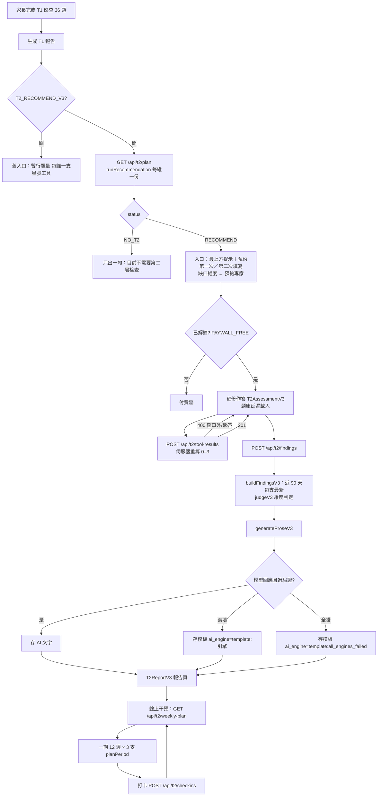
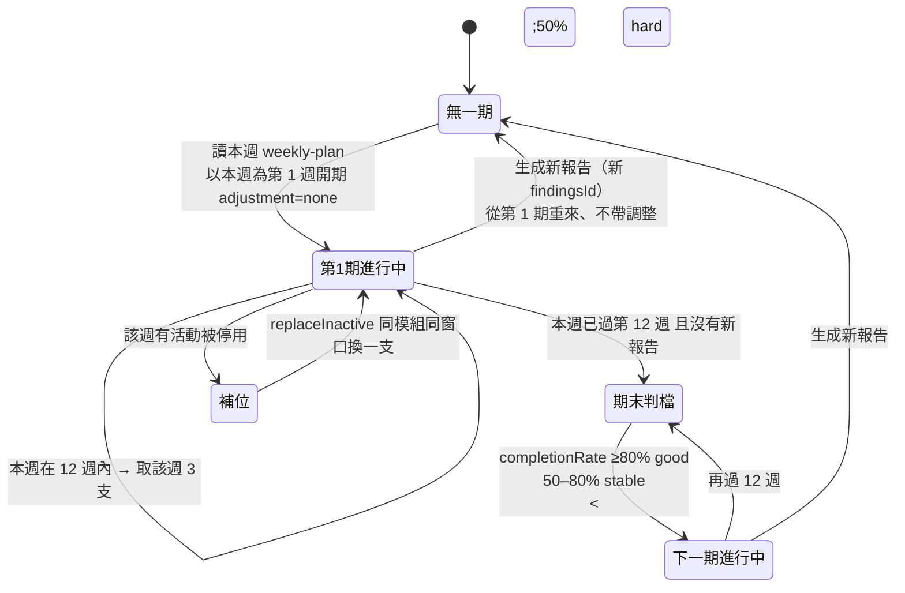
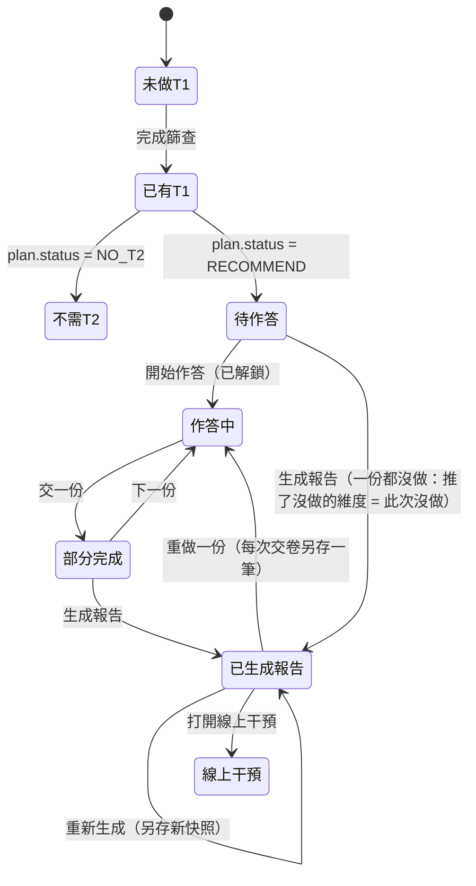
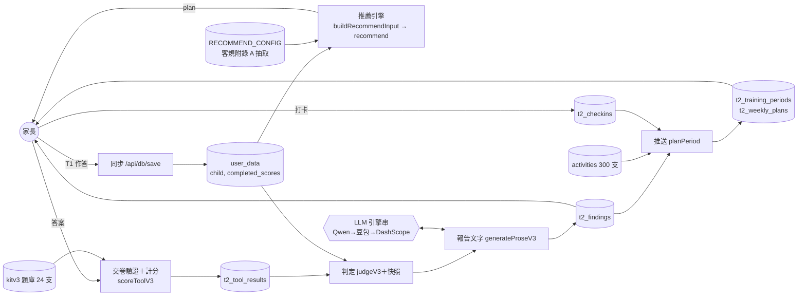
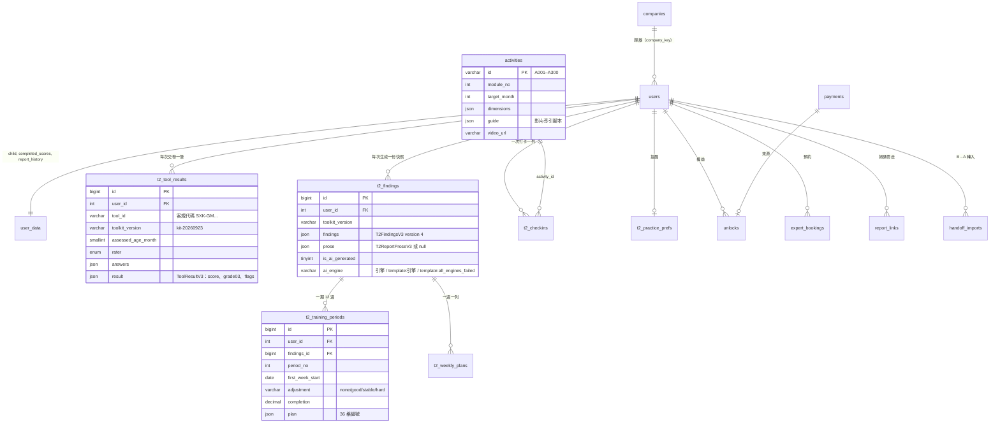

# T2 v3 技術驗收報告與軟體工程規格書

> 範圍：客戶 2026-10-06 的三份檔（《T2 量表推荐规则规格书 v1.0》《评估结果对应训练活动 推送规则说明》、9/23 完整版工具包）
> 加上使用者 10/07–10/08 的決定（ADR-0011 每維一份、報告接 AI）。所有新行為都在兩個開關後面、預設關：
> `T2_RECOMMEND_V3`（量表推薦＋完整版題庫＋新報告）、`TRAINING_PUSH_V3`（一期 12 週推送）。前者要求後者同時開。
>
> 施工規則、每一張票的 commit 與驗收在 `docs/specs/t2-v3-worklog.md`；暫採與待問在 `docs/specs/t2-v3-open-questions.md`。
> 本報告只做彙整與設計說明，不重複那兩份的逐條內容。

## 0. 一頁結論

| 項目 | 狀態 |
|---|---|
| 推送規則（P01–P17） | ✅ 全部實作；推送票 6（拿掉舊配對）**按規格延後**到開關正式打開之後 |
| 量表推薦（R1–R4） | ✅ 實作；**每維一份**偏離客規（ADR-0011）；R5（拿掉暫行題量）按規格延後 |
| 完整版題庫（R3a–R3i，24 支） | ✅ 抽取、計分、0–3、交卷、判定、作答畫面、報告頁、紙本比對 |
| v3 報告文字 | ✅ 接 AI（與 T1 報告同一串引擎）＋驗證器＋模板退路 |
| 全套測試 | ✅ 195 檔、3995 項全綠（2026-10-08） |
| 上線前置 | ⏸ 使用者驗收 → 正式站跑遷移 → 開兩個開關（見 §6.4） |
| 平行進行 | T1 報告去假數字（子代理，分支 `t1-report-real`，結果另行回報） |

---

## 1. v3 規格覆蓋矩陣（Traceability Matrix）

逐條矩陣（約 150 條，三份文件各一張表，含實作位置與測試檔）：**[t2-v3-traceability-2026-10-08.md](t2-v3-traceability-2026-10-08.md)**。
背景 agent 逐條比對產出、主線逐項核對；比對中找到的兩條缺口當場補上（計劃頁的期末三檔判斷標準、邊界聲明）。

| 文件 | 條數（約） | ✅ 已實作 | ⚠️ 實作＋暫採 | 🔀 刻意偏離 | ⏸ 延後 | ❌ 未實作 | ? 證據不足 |
|---|---:|---:|---:|---:|---:|---:|---:|
| 推薦規格書（REC） | 76 | 36 | 15 | 19 | 2 | 0 | 3 |
| 推送規則說明（PUSH） | 45 | 23 | 13 | 6 | 1 | 0 | 2 |
| 完整版工具包（KIT） | 29 | 14 | 12 | 3 | 0 | 0 | 0 |

閱讀方式：
- **「引擎 ✅／執行期 🔀」**：推薦引擎完整照客規實作，客規的 30 格標準表、10 個案例、V1–V13 都有逐格測試；
  但家長端執行期走 ADR-0011 的每維一份，深度、基線、補足、規則推問卷、診斷、5 份／90 分鐘上限都關掉。這類列計為 🔀。
- **⚠️** 都對應待問表的一個 R 編號，是「客戶沒定、我們先採一個做法」。
- **剩下的 ?**：V13 少數月齡邊界未逐行列在測試標題、缺口句的逐項說法、模組編號公式只有間接保護、打卡統計註解仍寫「x/4」
  （實際分母是動態的 3）、12 個月以下的入口（T1 從 12 個月起，走不到）。都不影響行為，列在矩陣第四節。
- **刻意不做**：計劃頁列印／存 PDF（客戶描述的是他們的離線單頁工具；本產品是手機線上 App），待使用者決定是否另開票。

---

## 2. 缺漏功能補充分析（Gap Analysis & Enhancements）

### 2.1 原始規格的遺漏、矛盾與未定義邊界

| # | 來源 | 問題 | 本次處理 | 依據 |
|---|---|---|---|---|
| G1 | 推薦規格書全篇 | 假設有**治療師在場**（T3 當面工具、M-CHAT 第二階段訪談、EMO 安全題由治療師問、ASR 觀察活動）；本產品 T2 是家長在手機上自填 | T3 不回、不出；M-CHAT 只做第一階段；安全題不問家長；ASR 依日常觀察答 | R-17、R-18、R-21 |
| G2 | 推薦規格書 §14 V3／V11 vs 演算法 | 「推薦 3–5 份」與補足清單只有 4 支、年齡與近 3 個月排除後補不到 3 份互相矛盾 | 照演算法；每維一份模式下不再補足 | R-13、ADR-0011 |
| G3 | 推薦規格書 §11／§12 | 表與演算法算出來不同 | 以表為準，差異列勘誤 | R-2、R-14 |
| G4 | 推薦規格書 | 沒定義各工具的分級怎麼換成每個主維度的 **0–3** | 逐支定對照，判定取最重（`judgeV3.ts`） | R-7、R-12 |
| G5 | 推薦規格書 | 「近 3 個月做過」沒定義怎麼算；做完後重算推薦會把做過的排除，報告判定就變成「沒推」 | 交卷 90 天內每支最新一筆；快照的「推了哪些」不排除做過的 | R-29、R-30 |
| G6 | 推薦規格書 | 重點維度加第二份、補足、基線 → 家長題量最多 5 份 90 分鐘，與使用者「每維一份」方向衝突 | 每維一份、不套上限（使用者決定） | ADR-0011、R-35 |
| G7 | 推薦規格書 | 規則必推（M-CHAT／情緒／抽動）會讓同一維度兩份；M-CHAT 是自閉症篩查，報告不能出現那個詞 | 規則觸發改成入口與報告最上方提示＋預約 | ADR-0011 |
| G8 | 推薦規格書 | 診斷是家長自述、無法核實，且是敏感健康資料 | 拿掉診斷那一題，引擎不吃診斷 | ADR-0011、R-10 |
| G9 | 推薦規格書 | 模板用字踩客戶自己的《用语对照表》（「落后」「红旗」） | 家長端的字另寫（`parentPlan.ts`），進用字掃描 | R-8 |
| G10 | 完整版工具包 IT 說明書 | 建議內嵌頁面、不重算；但頁面是治療室用、報告字過不了對照表、`postMessage` 分段與頁面不同 | 抽資料、伺服器重算 | ADR-0010、R-15、R-16 |
| G11 | 完整版工具包 | ASQ3 客規窗口 1 個月起、頁面最小題組 3 個月；SPb 擋 60–71 月；氣質 9–11 月空窗、36 月兩表重疊；LDP 月齡→年級未定 | 各給一條暫採 | R-20、R-23、R-27、R-28 |
| G12 | 完整版工具包 | M-CHAT、SNAP-IV、CHEXI 授權範圍（院內／研究）與付費家長 App 是否相容 | 照接，**請客戶確認授權** | R-26 |
| G13 | 推送規則說明 | 窗口不夠時往哪邊放寬、只有一兩個能力時名額衝突、7 分該不該配活動、期末沒有治療師怎麼判、換著玩要不要 | 推送規格 §8 九條暫採 | 推送規格 §8 |
| G14 | 推送規則說明 | 每週 3 支連帶打卡統計 x/4 → x/3、Keep 畫面的「4」 | 一起改（P16） | worklog |
| G15 | 完整版報告 | 規格只說「報告畫面要改」，沒給字數、沒說作答回顧怎麼挑題、提示字句、AI 或模板 | 字數暫採、回顧挑最差兩檔（兩檔題不列）、提示中性句、接 AI＋模板退路 | R-31、R-32、R-34 |
| G16 | 推薦規格書 | 時間上限移除題目後，**被標記的維度可能完全消失**（既沒有問卷也不在缺口裡）；一份跨維度問卷＋另一份會讓同一維度兩份 | 窮舉測試抓到；每維一份模式修正（不套上限、不重複涵蓋） | `t2RecommendOnePerDimension.test.ts` |

### 2.2 本次主動補齊的功能、欄位與防護

| 補齊 | 內容 | 技術理由 |
|---|---|---|
| 伺服器算分 | 交卷只收答案，分數、0–3、旗標由伺服器照題庫重算；窗口外、缺答、多題、值域外 400 不落表 | 付費報告的判定不能信瀏覽器；家長改前端就能改判定 |
| 作答月齡與情境 | plan 回 `answerAgeMonth`（早產 < 24 月矯正）與 `context`（上學、性別），畫面出題與伺服器驗卷同一份 `askedItems` | 避免畫面出的題與伺服器認的題不同而交不了卷 |
| 題庫延遲載入 | 24 支每支一個 chunk，打開才下載 | 家長端 bundle 不因題庫變大 |
| 開關組合檢查 | `T2_RECOMMEND_V3` 沒配 `TRAINING_PUSH_V3` 程序起不來；回退保護：舊路徑讀到 v3 快照回 409 | 不讓錯誤設定等到第一位家長才 500 |
| 快照版本分流 | `toolkitVersion` 區分 9/08 與完整版，舊快照照存的樣子讀 | 迁移只加不删，程式碼退回時資料庫不必跟著退 |
| 報告文字驗證器 | 形狀、要成段的維度不多不少、黑名單（診斷名、儀器療程藥物、舊量表名）、《用语对照表》禁字；不過就整份丟、退模板；`ai_engine` 記三種出口 | 模型輸出不可信；家長按「生成」一定拿到一份合格報告 |
| 不寫量表名稱 | 模型與模板都只講維度 | 客戶量表名稱含禁字（「自闭」「学习障碍」） |
| 提示點名 T1 題目 | 社交溝通警訊那一句列出孩子卡住的 T1 題目原文 | 「筛查里和别人互动的几题」家長看不懂（使用者回饋） |
| 紙本比對工具 | `t2-diff-paper.ts --kit v3`：2709 句、26 句不一致清單給客戶 | 題庫抽自 HTML，紙本才是題目權威 |
| 用字掃描 | 所有新的家長端檔案進 `parentWording.structure` 掃描 | 對照表禁字回流的唯一護欄 |

---

## 3. 流程圖與架構設計

### 3.1 系統流程圖（家長從篩查到線上干預）

切入視角：**家長的一次完整旅程**，標出每個判斷點與退路。

關鍵判斷節點：開關（C）、推薦狀態（E）、解鎖（G）、伺服器驗卷（I）、模型三出口（M）。
例外分流：交卷 400 回到作答畫面且不落表；模型失敗一律退模板，**沒有「報告產不出來」的出口**。

### 3.2 狀態機：一期線上干預的生命週期

判檔效果：`good` 顏色往輕一格、做法換「难一点」；`hard` 往重一格、每月名額降、做法換「简单」；`stable` 避開上一期用過的。

### 3.3 狀態機：家長端 T2（v3）

### 3.4 資料流圖（DFD）

---

## 4. App 軟體工程規格書（SRS & Design Doc）

### 4.1 系統架構

- **Client–Server、分層**：React 19 SPA（Vite 建置）↔ Express 4 單一伺服器（esbuild 打包）↔ MySQL（阿里雲 RDS）。
  正式站一台 ECS 跑兩個程序：專案 A（`sxk-app`，完整版，含 T2）與專案 B（`sxk-b`，只有 T1）；nginx 純代理。
- **分層**（以 T2 v3 為例）：
  1. 路由層 `server.ts`：登入、閘門（付費／線上干預收費站）、開關分流、注入資料層；
  2. 領域層 `src/t2/**`：全部純函式 —— 推薦引擎、計分、判定、推送、報告文字、家長端句子；
  3. 資料層 `src/db/**`：每張表一個模組，讀寫都帶 `user_id`，身分只取自 token；
  4. 畫面層 `src/components/**`：只畫、不算；句子一律取自領域層的 copy 檔（進用字掃描）。
- **組態與開關**：環境變數，只收 `1/true/0/false`，認不得的值程序起不來；客戶規則表（推薦設定、題庫、活動內容）由腳本從客戶原檔抽成常數，`--check` 與結構測試防漂移。

### 4.2 資料模型與關聯（ER）

快照 `T2FindingsV3`（JSON，寫下後不改）：`child`、`t1`（九維 T1 標記）、`t1Notices`（提示原句＋是否附預約）、`recommended`（不排除做過的）、
`dimensions[]`（`band`、`grade03`、`drivenBy`、`tools`）、`toolResults[]`（近 90 天每支最新）、`notices[]`（工具旗標）。

### 4.3 關鍵 API 契約（REST，v3 相關）

| 端點 | 方法 | 請求 | 回應 | 錯誤 |
|---|---|---|---|---|
| `/api/t2/plan` | GET | Bearer | `PlanV3Response`：`version:'v3'`、`status`、`tools[]{code,name,dimension,reason,rater,minutes,session}`、`totalMinutes`、`sessions`、`notices[]{kind,text,book?}`、`gaps[]`、`noT2Text?`、`ageMonth`、`answerAgeMonth`、`context`、`completed[]` | 401 未登入；404 `T1_REQUIRED`；400 `CHILD_AGE_REQUIRED` |
| `/api/t2/tool-results` | POST | `{toolkitVersion:'kit-20260923', toolId, assessedAgeMonth, rater, answers, grade?}` | 201 `{id, createdAt, result}` | 400 `TOOL_UNKNOWN`／`AGE_OUT_OF_WINDOW`／`ANSWERS_INVALID`／`ANSWERS_UNEXPECTED`／`RATER_INVALID`／`GRADE_INVALID`（不落表）；403 `LOCKED` |
| `/api/t2/tool-results?kit=v3` | GET | Bearer | 每支最新一筆 | 403 `LOCKED` |
| `/api/t2/findings` | POST | Bearer | 201 `{id, createdAt, findings, prose, isAiGenerated, aiEngine}` | 500 只在資料庫寫不進去；模型失敗不算錯 |
| `/api/t2/findings/latest` | GET | Bearer | 同上 | 404 沒生成過 |
| `/api/t2/weekly-plan` | GET | Bearer、`week?` | 本週 3 支＋`alternates`＋`plan{weekIndex,totalWeeks,firstWeekStart}` | 400 `WEEK_OUT_OF_RANGE`；409 `FINDINGS_VERSION`（開關關著讀到 v3 快照） |
| `/api/t2/checkins` | POST／GET／PATCH | 見 AGENTS.md | | 404 別人的打卡 |

契約原則：身分只取自 token（body／query 的 `userId` 一律不採信）；錯誤一律 `{error, code}`，`error` 是給家長看的句子、`code` 給程式；回應形狀由 `version`／`toolkitVersion` 分流，舊前端遇到 v3 形狀不會誤讀。

### 4.4 核心演算法

1. **推薦（每維一份，`recommend(input, config, {onePerDimension:true})`）**
   標籤（逐題關鍵題、紅旗）→ 維度排隊（P1 紅旗／社交警訊、P3 中度以上、P4 輕度）→ 全面落後時先放一份跨領域量表 →
   依排隊逐維從首選順序挑第一份「年齡合適、填寫人可行、近 90 天沒做、**不會讓任何維度變兩份**」的 → 挑不到列缺口。
   規則觸發只留在 `tags`，入口與報告轉成提示。不套 5 份／90 分鐘上限（R-35）。
2. **計分與 0–3（`scoreKitV3`）**：14 個計分族（達成率、帶差、關切率、困擾率、矩陣、嚴重度……），每族照頁面公式；
   「不确定／看不到／不适用」不進分子分母；整段無法觀察；分級名稱只進後台。
3. **維度判定（`judgeV3`）**：不篩 → `not_screened`；這一維沒有任何 0–3 結果 → 推了：T1 紅 `partial`／黃 `not_assessed`／綠 `clear`，
   沒推且 T1 有標記 → `no_tool`；有結果 → 取最重 0–3（0 `clear`、1–2 `watch`、3 `refer`）。
4. **推送（`planPeriod`）**：顏色（T2 0–3 或 T1 推定）→ 參加能力與 PUSH_ORDER → 每月 12 格名額（單一能力上限 6）→ 平滑加權輪詢交錯 →
   月齡窗口三等分 → 依編號挑、不夠放寬 → 一期 36 格一次排好存起來；期末依完成率判檔。
5. **報告文字（`generateProseV3`）**：提示（不給題目原文、作答、量表名稱）→ 引擎串 → 驗證（形狀／維度集合／黑名單／禁字／字數）→ 退模板。

### 4.5 前端狀態管理

- 沒有全域 store：每個頁面元件自己用 `useState` 讀一次 API，**伺服器是唯一真相**（plan、tool-results、findings 都由伺服器算）。
- 分流靠回應形狀：`T2Entrance`／`T2Assessment` 看 `plan.version`、`T2Report` 看 `findings.toolkitVersion`，各自換畫 V3 元件。
- 作答草稿只在元件記憶體裡（關掉頁面就沒了）；交卷成功才在清單上標完成，不重讀推薦（避免清單在家長眼前變動）。
- 線上干預用頁面堆疊（`layerStack`，一層一個 history 項），跟練方式這種個人偏好存 `localStorage`（讀寫都包 try/catch）。

### 4.6 例外與錯誤處理策略

| 層 | 策略 |
|---|---|
| 設定 | 開關值或組合不合法 → 程序起不來（fail fast），不等家長觸發 |
| 輸入 | 交卷、打卡、提醒的輸入檢查集中在純函式（`readV3Submission`、`practice.ts`），不合格 400、**不落表** |
| 外部服務 | LLM：三段引擎串，全掛退模板；簡訊：通道沒設齊回 503「尚未开放」，不假裝成功 |
| 資料 | 快照壞掉只讓那一格當「未記錄」；舊版本照存的樣子讀；版本不符回 409 而不是畫錯 |
| 畫面 | 每個讀取都有 loading／error 兩態；題庫 chunk 載不到只影響那一支；氣質、回顧缺題庫時那一段不出，不影響判定 |

### 4.7 非功能性需求

- **安全**：手機號驗證碼登入（無密碼）；session token 帶使用者 id，所有資料讀寫帶 `user_id`（結構測試護欄）；判定與分數伺服器算；
  `.ics` 短時效連結用 AES-256-GCM；B→A 交接碼只存雜湊；家長端整站 `no-referrer`；報告文字過黑名單與禁字。
  **已知風險**：掃碼報告連結永久有效、無撤回（產品既定取捨）；示範片 `/media` 公開不驗登入。
- **可擴展**：題庫、推薦設定、活動內容都是「客戶原檔 → 腳本 → 常數／遷移」，換版重跑抽取即可；新工具加一份配方＋測試；
  影片放主機靜態目錄（40 GB 碟剩 33 GB，頻寬是先遇到的瓶頸；量大時改 OSS＋CDN，需另做決定）。
- **離線與快取**：沒有離線同步 —— 交卷與打卡要連線；但作答中的答案會存成這支手機上的草稿（`draftV3.ts`），斷線、關頁回來接著答。快取：題庫 chunk 由瀏覽器快取、示範片一小時＋ETag、
  Range 回 206（iOS）。
- **可觀測性**：`ai_engine` 記錄每份報告是 AI、哪一台寫壞、或全掛；退模板時伺服器日誌記驗證錯誤。
- **可回退**：新行為全在開關後面；遷移只加不删；回退＝關開關。

---

## 5. 尚待決定與建議的下一步

| # | 事項 | 誰決定 | 建議 |
|---|---|---|---|
| 1 | 打開兩個開關前的驗收（入口、作答、報告、線上干預各走一遍） | 使用者 | 先在 Render 展示站開，正式站後開 |
| 2 | R-35 題量上限（被標記 6 維以上時） | 使用者 | 觀察實際分布再定 |
| 3 | R-3／R-32 提示字句、R-26 授權、R-15 重算、紙本 26 句差異 | 客戶 | 一次整理帶去 |
| 4 | ~~作答離線：手機斷線時作答會遺失~~ | — | ✅ 2026-10-08 已補：草稿存這支手機（`src/t2/draftV3.ts`，每支一份、7 天、交卷清掉） |
| 5 | R5、推送票 6（刪舊程式碼） | — | 開關正式打開、觀察一段時間後 |
| 6 | 示範片量大時的頻寬 | 使用者 | 先查 ECS 公網頻寬 |
