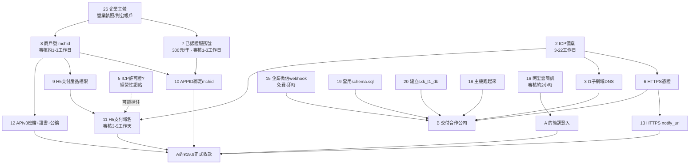

# 專案外部依賴清冊（不是寫程式能解決的事）

> 產出日期：2026-07-30
> 用途：列出專案 A 與專案 B 上線前需要的**帳號、資質、備案、審核、憑證、平台申請**。程式碼側的進度見 [實作計畫.md](./實作計畫.md)，業務與法務待決事項見 [與客戶討論的問題.md](./與客戶討論的問題.md)。
> 本文取代 [待你處理的事項.md](./待你處理的事項.md)（那份是同一批事實的較早版本）。
>
> **體例三條規則**：
> 1. **工期只有兩種**：有官方明文的，逐條附來源網址與查證日期；沒有官方明文的，一律寫「**無依據**」，本文不編造數字。
> 2. **狀態只有四種**：`✅ 已完成`／`🔄 進行中`／`⬜ 未開始`／`❓ 不確定`。查不到就寫不確定，不猜。
> 3. **A／B 欄位**是本文的主軸：`A 專屬`／`B 專屬`／`兩者共用`／`兩者各需一份`。

---

## 零、2026-07-30 實際打過的線上狀態（先把事實擺出來）

以下六行不是從文件抄的，是今天當場量的：

| 量測 | 結果 | 這代表什麼 |
|---|---|---|
| `nslookup sxkscreen.com` | → `47.116.141.185` | 主網域 DNS 已指向阿里雲主機 |
| `nslookup t1.sxkscreen.com` | **`Non-existent domain`** | **專案 B 的網域在 DNS 上還不存在**，連一筆 A 記錄都還沒加 |
| `curl http://sxkscreen.com/` | `502`，1.8 秒 | 走網域進得去、nginx 活著、Node 沒跑。**沒有被攔截頁接走** |
| `curl http://47.116.141.185/` | `502`，0.9 秒 | 同上，用 IP 走也一樣 |
| `curl https://sxkscreen.com/` | **逾時無回應**（12 秒 0 位元組） | **443 沒有服務 → 沒有 HTTPS** |
| `curl https://sxk.onrender.com/api/db/status` | `{"configured":false,"engine":"memory"}`，0.26 秒 | Render A **醒著且很快**，但**沒有接資料庫** |
| `curl https://sxk-t1.onrender.com/api/db/status` | `{"configured":false,"engine":"memory"}`，0.23 秒 | Render B 同上 |

三個直接的推論：

1. **Render 兩個 service 的 `MYSQL_*` 都沒填。** 這代表付費牆不執行（展示模式全放行）、專家預約寫進記憶體重啟就消失。
2. **Render 今天沒有休眠問題**（0.2 秒回應）。[檢查發現.md](./檢查發現.md) 記的 31 分鐘 68 次零回應，今天沒有重現 —— 那份記錄不必推翻，但「現在是不是還在壞」的答案是**現在沒壞**。
3. **主網域走 HTTP 沒有被攔截**，這是備案可能已通過的**跡象**，但不是證明（見第 2 項）。

---

## 全表索引（先掃這張，再看細節）

| # | 項目 | A／B | 狀態 |
|---|---|---|---|
| **網域與備案** ||||
| 1 | 網域 `sxkscreen.com` | 兩者共用 | ✅ 已完成 |
| 2 | ICP 備案（主體：森心康） | 兩者共用 | ❓ 不確定 |
| 3 | 子網域 `t1.sxkscreen.com` 的 DNS 記錄 | **B 專屬** | ⬜ 未開始 |
| 4 | 公安聯網備案 | 兩者共用 | ❓ 不確定 |
| 5 | 經營性 ICP 許可證（增值電信業務） | **A 專屬**（因為 A 收費） | ❓ 不確定 |
| 6 | HTTPS 憑證（含子網域） | 兩者各需涵蓋 | ⬜ 未開始 |
| **微信生態** ||||
| 7 | 已認證公眾帳號（服務號／小程序） | **A 專屬**（B 目前不需要） | ❓ 不確定 |
| 8 | 微信支付商戶號 mchid | **A 專屬** | ❓ 不確定 |
| 9 | H5 支付產品權限 | **A 專屬** | ⬜ 未開始 |
| 10 | APPID 與 mchid 授權綁定 | **A 專屬** | ⬜ 未開始 |
| 11 | H5 支付域名配置（3–5 工作天審核） | **A 專屬** | ⬜ 未開始 |
| 12 | APIv3 密鑰 + 商戶 API 證書 + 微信支付公鑰 | **A 專屬** | ⬜ 未開始 |
| 13 | 公網 HTTPS `notify_url` | **A 專屬** | ⬜ 未開始 |
| 14 | JSAPI 支付（若微信內流量佔比高才需要） | **A 專屬** | ⬜ 未開始（程式回 501） |
| **通知與客服** ||||
| 15 | 企業微信群機器人 webhook | **兩者各需一份** | ⬜ 未開始 |
| 16 | 阿里雲簡訊簽名 + 模板 | 兩者共用 | ⬜ 未開始 |
| 17 | 客服微信號 + 二維碼圖片 | **兩者各需一份** | ⬜ 未開始（程式中仍是佔位值） |
| **雲端、資料庫與 AI** ||||
| 18 | 阿里雲主機 + RDS | 兩者共用 | ✅ 已購買，⬜ 未啟用 |
| 19 | 線上資料庫套用 `schema.sql`（`sxk_db`） | **A 專屬** | ⬜ 未開始 |
| 20 | 建立 `sxk_t1_db` 並套用同一份 schema | **B 專屬** | ⬜ 未開始 |
| 21 | DashScope 帳號與 API Key | 兩者各需填 | ✅ 已填（依你告知） |
| 22 | Gemini API Key（境內不可直連） | 兩者各需填 | ✅ 已填（依你告知） |
| 23 | Coze SDK 憑證（AI 引擎 1、2） | 兩者共用 | ⬜ 未開始 — **正式環境等於永久缺席** |
| 24 | `SESSION_SECRET`（阿里雲側） | **兩者各需一份** | ⬜ 未開始 |
| 25 | Render 帳號與兩個 service | 兩者共用 | ✅ 已完成 |
| **資質與法務** ||||
| 26 | 企業主體資質（營業執照、法人證件、對公帳戶） | **A 專屬**（B 不收款） | ❓ 不確定 |
| 27 | 醫療器械／保健食品／醫學檢驗資質 | **A 專屬**（階段 4 商城） | ❓ 不確定 |
| 28 | 臨床量表名稱的授權或改名決定 | **A 專屬**（量表在 T2/T3） | ❓ 待決 |
| 29 | 三位專家的姓名、肖像與接單同意 | **兩者共用**（B 沿用同三位） | ❓ 待決 |
| 30 | 隱私政策、監護人同意、第三方分享同意 | **兩者共用**（B 更急） | ⬜ 未開始 |
| 31 | 退款政策文字 | **A 專屬** | ⬜ 未開始 |

---

# 一、網域與備案

## 1. 網域 `sxkscreen.com`

| | |
|---|---|
| **A／B** | 兩者共用（A 用主網域，B 用子網域） |
| **狀態** | ✅ 已完成 |
| **預估工期** | — |
| **前置條件** | — |
| **卡住誰** | 已不卡任何東西 |

**為什麼需要**：備案、微信支付 H5 域名、HTTPS 憑證都掛在這個網域上。今天實測 DNS 解析到 `47.116.141.185`，購買時間依 [實作計畫.md](./實作計畫.md) 為 2026-07-16 前後。

---

## 2. ICP 備案（主體：森心康）

| | |
|---|---|
| **A／B** | **兩者共用** —— 同主體、同接入商、同伺服器，子網域被主網域涵蓋 |
| **狀態** | ❓ **不確定** |
| **預估工期** | 阿里雲初審 **1–2 個工作日**；管局審核 **1–20 個工作日**；整體約 **3–22 個工作日**（[阿里雲 ICP 備案流程概述](https://help.aliyun.com/zh/icp-filing/basic-icp-service/user-guide/icp-filing-application-overview)、[管局審核流程時長](https://help.aliyun.com/zh/icp-filing/basic-icp-service/user-guide/administration-review)，2026-07-30 查證） |
| **前置條件** | 網域已購、主機在阿里雲、企業證件、法人核驗、**接聽阿里雲核驗電話** |
| **卡住誰** | HTTPS、微信支付**全部七項**、正式站對外開放、專案 B 交付 |

**為什麼需要**：沒有備案，網域指向中國大陸主機的 80／443 會被接入商攔截 —— 不是網站變慢，是**整個網域打不開**。而且微信支付 H5 支付域名的配置頁會擋在備案這一關（見第 11 項）。

**目前狀態為什麼是「不確定」而不是「進行中」**：

- [實作計畫.md](./實作計畫.md) 寫「ICP 備案已送出」，但那是文件記載，不是我今天驗到的。
- 今天實測 `http://sxkscreen.com/` 回 **502**（nginx 的錯誤頁），不是接入商的「未備案」攔截頁。**這是備案已通過的跡象**，因為未備案網域指向大陸節點通常在這一層就被接走了。
- 但 502 也可能出現在其他情況下，**這不構成證明**。
- **要確認只需一件事**：登入阿里雲「ICP 代備案管理系統」看有沒有備案號，或到 [工信部 ICP/IP 位址/網域資訊備案管理系統](https://beian.miit.gov.cn) 查 `sxkscreen.com`。**這一步只有你能做**（需要帳號登入）。

⚠️ **審核期間阿里雲會來電核驗，務必接聽** —— 沒接就退件重來，整條時程從頭算。

---

## 3. 子網域 `t1.sxkscreen.com` 的 DNS 記錄

| | |
|---|---|
| **A／B** | **B 專屬** |
| **狀態** | ⬜ **未開始** —— 今天實測 `Non-existent domain` |
| **預估工期** | DNS 生效通常數分鐘至數小時（**無官方明文依據，不列具體數字**） |
| **前置條件** | 主網域備案通過（第 2 項）；主機上要有對應的 nginx server block |
| **卡住誰** | **專案 B 的整個交付** —— 沒有這個位址，合作公司拿不到任何可用的網址 |

**為什麼需要**：專案 B 的交付形式就是一個網址。目前這個網址在 DNS 上不存在，也就是說**專案 B 現在沒有正式環境**，只有 `sxk-t1.onrender.com` 這個展示站。

**備案面的好消息**：主網域備案通過後，**子網域不需要單獨備案**（[阿里雲：不同場景下 ICP 備案的常見問題](https://help.aliyun.com/zh/icp-filing/basic-icp-service/product-overview/faq-about-icp-filing-applications-in-different-scenarios)，2026-07-30 查證）。前提是同主體、同接入商。這一點與 [與客戶討論的問題.md](./與客戶討論的問題.md) 第七項的記載一致。

⚠️ **但微信支付那邊不吃這一套** —— 見第 11 項。備案上子網域被涵蓋，**H5 支付域名配置上子網域是另一個域名**，兩件事不要混。

**還缺的配套（都在主機上做，不是程式問題）**：

- [`deploy/nginx.conf`](./deploy/nginx.conf) 的 `server_name` 目前仍是佔位符 `your-domain.com`，且**只有一個 server block**，沒有子網域的。
- [`deploy/ecosystem.config.js`](./deploy/ecosystem.config.js) **只定義了一個 PM2 程序 `sxk`**，專案 B 的第二個程序不存在。B 要獨立程序（不同 `APP_MODE`、不同 `MYSQL_DATABASE`、不同埠）。

---

## 4. 公安聯網備案

| | |
|---|---|
| **A／B** | 兩者共用 |
| **狀態** | ❓ 不確定 |
| **預估工期** | **無依據** —— 本文未取得一手官方明文 |
| **前置條件** | ICP 備案通過（第 2 項） |
| **卡住誰** | 合規性；不影響技術上線，但屬於監管要求 |

**為什麼需要**：ICP 備案通過後還有一道公安機關的聯網備案。阿里雲把它寫在同一份流程文件裡：[網站備案全流程含 ICP 備案及公安聯網備案](https://help.aliyun.com/zh/dws/icp-filing)（2026-07-30 查證，標題即含此步驟）。

⚠️ **辦理期限我不寫數字。** 坊間常見「ICP 備案通過後 30 日內」的說法，但我沒有從一手官方頁面取得這句明文，所以**這一項的期限需向阿里雲備案客服或當地公安機關網安部門確認**。

---

## 5. 經營性 ICP 許可證（增值電信業務經營許可證）

| | |
|---|---|
| **A／B** | **A 專屬** —— B 不收費，性質不同 |
| **狀態** | ❓ **不確定，且這一項可能被低估** |
| **預估工期** | **無依據** |
| **前置條件** | 公司主體、註冊資本等條件（**需向當地通信管理局確認**） |
| **卡住誰** | 可能卡住第 11 項（H5 支付域名配置） |

**為什麼需要**：這一項不是我推測出來的，是**微信支付自己的頁面寫的**。配置 H5 支付域名的官方頁面原文：

> 「经营性网站必须办理ICP许可证，事业单位必须办理ICP备案；**ICP备案的主体必须与申请商户号主体一致**」

來源：[配置 H5 支付域名](https://pay.weixin.qq.com/doc/v3/merchant/4013287193)（[`docs/research/wechat-pay-v3-h5.md`](./docs/research/wechat-pay-v3-h5.md) 第 6 節已引，2026-07-30 我重新抓取確認同一句仍在）。

**風險在哪**：專案 A 要在網站上直接向家長收 ¥19.9，這在中國大陸的定義下很可能屬於「經營性網站」，而經營性網站要的是 **ICP 許可證**（要申請、有條件、有年檢），不是一般的 **ICP 備案**（登記制）。兩者是不同的東西，時程與門檻差距很大。

**建議**：在申請商戶號之前，先向阿里雲備案客服或當地通信管理局問一句「線上銷售虛擬服務是否需要辦 ICP 許可證」。這句話問得早，可能省掉整批返工；問得晚，會在第 11 項卡住時才發現。

---

## 6. HTTPS 憑證

| | |
|---|---|
| **A／B** | **兩者都要被涵蓋** —— 主網域一張，子網域一張（或一張含 SAN／萬用憑證） |
| **狀態** | ⬜ **未開始** —— 今天實測 `https://sxkscreen.com/` **逾時無回應** |
| **預估工期** | 阿里雲免費 DV 憑證與 Let's Encrypt 通常當日可簽發（**無官方明文依據，不列具體數字**） |
| **前置條件** | ICP 備案通過（第 2 項）、子網域 DNS 已建（第 3 項） |
| **卡住誰** | 微信支付 `notify_url`（第 13 項，官方要求必須 `https://` 開頭）、隱私條款承諾、正式站的基本可信度 |

**為什麼需要**（三個獨立的理由，任何一個都足夠）：

1. **微信支付硬性要求**：`notify_url`「必须是以https://开头的完整全路径地址」（[回調通知注意事項](https://pay.weixin.qq.com/doc/v3/merchant/4012075420)）。沒有 HTTPS，回調收不到，付了錢也不會解鎖。
2. **隱私條款已經承諾了**：條款原文寫「傳輸過程採用 HTTPS/TLS 加密協議」，實際上 443 沒有服務。承諾了卻沒做，比沒承諾風險更高（[與客戶討論的問題.md](./與客戶討論的問題.md) 第三項）。
3. **家長要在這個頁面填孩子的健康資料和手機號。**

**做法**：[`deploy/README.md`](./deploy/README.md) 第八節已寫兩條路（阿里雲免費 SSL 憑證／Let's Encrypt certbot）。憑證到手後要**啟用 [`deploy/nginx.conf`](./deploy/nginx.conf) 第 58–75 行被註解掉的 HTTPS 與 80→443 轉址區塊**，並記得子網域也要一份。

---

# 二、微信生態（這一段有嚴格的先後順序）

> 這一整段**只有專案 A 需要**。專案 B 沒有付費、沒有微信登入、沒有公眾號選單，整段可以先不碰。
> 本段所有規則引自 [`docs/research/wechat-pay-v3-h5.md`](./docs/research/wechat-pay-v3-h5.md)（該文只採用微信支付官方文檔中心 `pay.weixin.qq.com/doc/v3/merchant/...`），部分條目我在 2026-07-30 重新抓取官方頁面複驗，複驗到的新事實會標明。

## 7. 已認證的公眾帳號（服務號／小程序）

| | |
|---|---|
| **A／B** | **A 專屬**。B 技術上完全不需要（見下方「B 到底要不要」） |
| **狀態** | ❓ **不確定 —— 這是整份清冊裡最該先弄清楚的一格** |
| **預估工期** | 註冊本身即時；**微信認證審核 1–3 個工作日**（[騰訊客服](https://kf.qq.com/faq/120911VrYVrA150525zUjQZB.html)，2026-07-30 查證，見下方但書） |
| **費用** | **微信認證 300 元／次，一年一審，認證失敗不退**（[騰訊客服：微信認證需要支付的費用？](https://kf.qq.com/faq/161219JvMNvi161219raieiY.html)，2026-07-30 查證，原文引用見下） |
| **前置條件** | 企業主體證件；**主體須為企業／事業單位／政府機關／社會組織 —— 個體戶不可** |
| **卡住誰** | 商戶號綁定 → H5 支付產品權限 → 整個 ¥19.9 收款。**這是微信支付鏈條的第一顆骨牌** |

### 為什麼需要

微信支付下單請求的 `appid` 是**必填**欄位，而該 APPID 必須已與商戶號完成授權綁定。官方明文：

> **「未认证的账号无法绑定商户号」**

來源：[H5 支付開發接入準備](https://pay.weixin.qq.com/doc/v3/merchant/4015614193)（2026-07-30 重新抓取，這句仍在）。

**缺了會怎樣**：不是「支付體驗差一點」，是**下單 API 根本呼叫不了**。程式已經寫好（[`src/wechatPay.ts`](./src/wechatPay.ts)），但沒有 APPID 就沒有合法的請求可以送出去。

### 要哪一種帳號？（這是你點名要問的）

微信支付 H5 支付的**准入應用類型**只有四種，官方原文列舉：

> 「已认证的服务号、已认证的政府或媒体类型的公众号、已认证的小程序、已认证的移动应用」

來源：[H5 支付產品介紹](https://pay.weixin.qq.com/doc/v3/merchant/4012791832)（2026-07-30 重新抓取確認）。

翻成人話，對森心康這種一般企業來說：

| 帳號類型 | 能不能用來接微信支付 | 說明 |
|---|---|---|
| **已認證服務號** | ✅ **可以** | 一般企業的標準解 |
| **已認證小程序** | ✅ 可以 | 但你目前沒有小程序產品，接了要另外做 |
| 已認證移動應用（App） | ✅ 可以 | 你沒有 App |
| 政府／媒體類型公眾號 | ✅ 可以 | 森心康不是政府或媒體 |
| **一般企業訂閱號** | ❌ **不在准入名單內** | 訂閱號不能拿來接微信支付 |
| **個人訂閱號** | ❌ 不可 | 主體就不合格 |

→ **結論：要「已認證服務號」。**（若未來做小程序，「已認證小程序」也是一條路，但那是另一個產品決策。）

⚠️ **主體限制**：H5 支付支援的主體是「企业、事业单位、政府机关、社会组织」，官方頁面**明確不支援個體戶**（2026-07-30 抓取 [產品介紹頁](https://pay.weixin.qq.com/doc/v3/merchant/4012791832) 確認）。**如果森心康目前是個體工商戶登記，這一條會直接擋死整條支付鏈** —— 請先確認營業執照上的主體類型。

### 要不要認證？費用與時程

**必須認證。** 費用與時程：

- **300 元／次**。官方原文：「微信公众号/服务号申请微信认证，需一次性支付300元/次审核服务费用」
- **一年有效**：「微信认证成功后，账号名称、认证标识、及认证特权将会被保留一年」→ 也就是**每年要再付一次 300 元年審費**
- **失敗不退**：「若认证审核失败，审核费用不予退还」
- 來源：[騰訊客服「微信認證需要支付的費用？」](https://kf.qq.com/faq/161219JvMNvi161219raieiY.html)，2026-07-30 查證

**審核時程**：騰訊客服頁面記載認證審核為 **1–3 個工作日**（[微信認證審核時間](https://kf.qq.com/faq/120911VrYVrA150525zUjQZB.html)）。
⚠️ **但書**：這一條我是透過搜尋結果摘要取得的，該頁面實際抓取時內容為 JS 動態載入、無法逐字複製原文。**時程數字請以你登入公眾平台後看到的頁面為準**，300 元的部分則有逐字原文可引。

### A 和 B 可不可以共用同一個？

**技術上可以，而且相當寬鬆。** 2026-07-30 抓取官方[商戶號綁定 APPID](https://pay.weixin.qq.com/doc/v3/merchant/4016328613) 頁面確認：

- 「**一个商户号最多可关联50个AppID账号**」
- 一個 APPID 也可以被多個商戶號綁定，但「发起绑定申请的商户号需与APPID已绑定的商户号**费率一致**，如不一致，暂不支持线上绑定」
- 主體不一致時需補《微信支付聯合營運承諾函》
- ⚠️ 「**暂不支持解绑**」—— 綁下去解不掉，所以不要拿測試帳號亂綁

**但實際上根本不用共用，因為 B 不需要**：

| 問題 | 答案 |
|---|---|
| A 需不需要公眾號？ | **需要**。¥19.9 收款的必要條件 |
| B 需不需要公眾號？ | **技術上完全不需要**。B 沒有付費、沒有微信登入、也沒有規劃公眾號選單入口。B 的入口是一個網址 |
| 那什麼情況下 B 才需要？ | 只有一種：**行銷上決定用公眾號選單當 B 的流量入口**（合作公司從公眾號導流）。那是產品決策，不是技術需求 |
| 若 B 之後真的要自己的公眾號？ | 要另一個帳號 + 另一筆 300 元／年。**且若那個帳號掛在合作公司主體下**，與森心康的商戶號綁定會走「主體不一致」流程（要簽承諾函）—— 這件事應該先想清楚再開帳號 |

**建議**：現在只開一個「森心康」的已認證服務號，A 用。B 先不開。合作結束時你也不會有一個掛在對方主體下、解不掉綁定的 APPID。

---

## 8. 微信支付商戶號（mchid）

| | |
|---|---|
| **A／B** | **A 專屬** |
| **狀態** | ❓ 不確定（[待你處理的事項.md](./待你處理的事項.md) 列為待辦，未見完成紀錄） |
| **預估工期** | 申請單提交後**約 1–3 個工作日**完成審核（[微信支付接入指引](https://pay.weixin.qq.com/static/applyment_guide/applyment_index.shtml)，2026-07-30 查證，見但書） |
| **前置條件** | 企業營業執照、法人／經營者身分證、**對公結算帳戶**、經營類目與對應資質 |
| **卡住誰** | 第 9～13 項全部。沒有 mchid，微信支付一步都走不了 |

**為什麼需要**：`mchid` 是每一支 APIv3 請求的必填欄位，也是 `Authorization` 簽名串的一部分。

**主體限制**（同第 7 項）：企業／事業單位／政府機關／社會組織，**個人主體不可**。來源：[H5 支付產品介紹](https://pay.weixin.qq.com/doc/v3/merchant/4012791832)。

⚠️ **經營類目要選「虛擬服務」，不要綁商城實體商品。** 這是 [與客戶討論的問題.md](./與客戶討論的問題.md) 第八項的已決議：商城賣的是腦電穿戴、康復輔具、腸道菌檢測，屬醫療器械／保健食品／醫學檢驗**特殊類目**，資質不齊會讓**整張申請單被駁回，連 ¥19.9 都收不了**。分兩階段申請，第一階段只申請虛擬服務。

⚠️ **但書**：1–3 個工作日與所需材料清單是我從官方接入指引頁的搜尋摘要取得，未能逐字抓取原文。**實際材料清單請以商戶平台申請頁面為準。**

---

## 9. H5 支付產品權限

| | |
|---|---|
| **A／B** | **A 專屬** |
| **狀態** | ⬜ 未開始 |
| **預估工期** | **無依據**（官方接入準備頁列為必經步驟，未載明審核時長） |
| **前置條件** | 商戶號（第 8 項） |
| **卡住誰** | H5 支付域名配置（第 11 項）、下單 API |

**為什麼需要**：商戶號開通後，H5 支付是要**另外申請的產品權限**，不是預設就有。官方接入準備流程第 5 步：「商戶平台申請 H5 支付產品權限」。來源：[開發接入準備](https://pay.weixin.qq.com/doc/v3/merchant/4015614193)。

---

## 10. APPID 與 mchid 授權綁定

| | |
|---|---|
| **A／B** | **A 專屬** |
| **狀態** | ⬜ 未開始 |
| **預估工期** | **無依據**（一般費率商戶未載明；官方僅載明「特殊行业费率商户」審核 1–3 個工作日） |
| **前置條件** | 已認證公眾帳號（第 7 項）+ 商戶號（第 8 項），**兩個都要先有** |
| **卡住誰** | 下單 API 的 `appid` 欄位 |

**為什麼需要**：兩邊各有一半 —— 商戶平台發起申請，然後要**登入公眾平台那一側確認授權**。兩步都做完才算綁定。來源：[商戶號綁定 APPID](https://pay.weixin.qq.com/doc/v3/merchant/4016328613)（2026-07-30 抓取）。

⚠️ **綁定「暫不支持解绑」** —— 官方原文。綁之前確認 APPID 是對的那一個。

---

## 11. H5 支付域名配置

| | |
|---|---|
| **A／B** | **A 專屬**（B 不收款，不需要） |
| **狀態** | ⬜ 未開始 |
| **預估工期** | **審核 3–5 個工作天**，審核通過後一般 10 分鐘內生效（[配置 H5 支付域名](https://pay.weixin.qq.com/doc/v3/merchant/4013287193)，2026-07-30 重新抓取確認：「提交配置后等待审核（3-5个工作日），审核通过后一般10分钟内生效」） |
| **前置條件** | ICP 備案完成（第 2 項）**且備案主體與商戶號主體一致**；H5 支付產品權限（第 9 項） |
| **卡住誰** | H5 支付跳轉。域名沒配，`h5_url` 一跳就報錯 |

**為什麼需要**：微信支付會檢查**發起跳轉那個網頁的 Referer 域名**是否在你配置的清單裡。沒配就是「商家参数格式有误，请联系商家解决」。

**2026-07-30 複驗到的三條新事實**（原研究文件未載明第一條）：

1. **最多可配置 5 個域名**。原文：「如需添加多个域名，请点击 + ，最多5个」
2. **域名必須完全一致，含大小寫**。「跳转支付使用的域名必须与配置的域名完全一致」，官方對照表：配置 `pay.com` 時，`http://Pay.com` 驗證失敗。
3. ⚠️ **子域名算另一個域名，不被主域名涵蓋**。官方對照表把 `http://pay.com`、`https://pay.com/pay/abc` 標為「正確」，但把 **`http://wx.pay.com` 標為「錯誤」**。

**第 3 條對本專案的直接意義**：ICP 備案上 `t1.sxkscreen.com` 被 `sxkscreen.com` 涵蓋（第 3 項），**但 H5 支付域名配置上它是獨立的一個域名**。目前 B 不收款所以不受影響；**如果哪天 B 也要收費，要另外佔一個域名額度並再等 3–5 個工作天**。

⚠️ **前端有一條配套的硬規則**（已寫在程式裡，這裡只是提醒不要改壞）：跳轉必須用一般導頁（`window.location.href`），**不可**用 `window.open(..., 'noreferrer')`，頁面也不可設 `Referrer-Policy: no-referrer` —— Referer 一空，支付直接失敗。

---

## 12. APIv3 密鑰 + 商戶 API 證書 + 微信支付公鑰

| | |
|---|---|
| **A／B** | **A 專屬**（[`render.yaml`](./render.yaml) 中 B 刻意沒有任何 `WECHATPAY_*`） |
| **狀態** | ⬜ 未開始 |
| **預估工期** | 商戶平台自助設定，即時（**無官方明文工期，不列數字**） |
| **前置條件** | 商戶號（第 8 項）+ 商戶平台管理員權限 |
| **卡住誰** | 請求簽名、回調驗簽、回調解密 —— 也就是**全部** |

**為什麼需要**：三樣東西各管一件事，缺一樣就有一半的流程不會動：

| 憑證 | 管什麼 | 缺了會怎樣 |
|---|---|---|
| **APIv3 密鑰**（恰 32 位字母數字） | 解密回調通知 | **微信根本不會發回調** —— 官方明文：未設置 apiV3key 或未配置 notify_url 時不發送回調 |
| **商戶 API 私鑰 `apiclient_key.pem` + 證書序列號** | 簽你送出去的每一個請求 | 下單請求被拒 |
| **微信支付公鑰 + 公鑰 ID** | 驗微信回給你的簽 | 無法確認回調是不是真的來自微信 |

來源：[證書密鑰概覽](https://pay.weixin.qq.com/doc/v3/merchant/4024350132)、[開發必要參數說明](https://pay.weixin.qq.com/doc/v3/merchant/4013070756)、[回調通知注意事項](https://pay.weixin.qq.com/doc/v3/merchant/4012075420)。

**三個操作上的坑**：

1. **商戶 API 私鑰「只能下载一次」**，遺失只能重新申請。下載當下就備份到安全的地方。
2. **APIv3 密鑰設定後不可讀回**，忘了只能重設 —— 而重設會讓正在跑的服務收不到回調。設定當下就存好。
3. **請選「微信支付公鑰」方案，不要用舊的平台證書。** 官方標示公鑰為【推薦】、「无过期时间」「维护更简单」。選公鑰可以讓我們省掉整套 `/v3/certificates` 下載、解密與輪換邏輯 —— 那些程式現在不存在，選錯方案就得補寫。

**填哪裡（實務提醒）**：

- 阿里雲主機：私鑰與公鑰**用檔案**，填 `WECHATPAY_PRIVATE_KEY_PATH` / `WECHATPAY_PUBLIC_KEY_PATH`（見 [`.env.example`](./.env.example)）。
- Render：沒有地方放 `.pem` 檔，要用 `WECHATPAY_PRIVATE_KEY` / `WECHATPAY_PUBLIC_KEY` **直接貼內容**（[`render.yaml`](./render.yaml) 定義的就是這兩個）。程式兩種都吃（[`src/wechatPay.ts:76-77`](./src/wechatPay.ts)）。
- ⚠️ **但 Render 上填了也收不到款**（`onrender.com` 不是我們的網域、無法備案、過不了第 11 項）。**不要浪費時間在 Render 上填微信支付憑證。**

---

## 13. 公網可達的 HTTPS `notify_url`

| | |
|---|---|
| **A／B** | **A 專屬** |
| **狀態** | ⬜ 未開始（今天實測 443 無服務） |
| **預估工期** | 憑證到手後即時 |
| **前置條件** | HTTPS 憑證（第 6 項）+ 備案（第 2 項） |
| **卡住誰** | 付款成功後的自動解鎖。沒有回調就只剩查單補償這一條路 |

**為什麼需要**：這是微信通知你「這筆錢收到了」的唯一主動管道。官方硬性規範（原文）：

- 「notify_url必须是以https://开头的完整全路径地址，并且确保URL中的域名和IP是外网可以访问的，不能填写localhost、127.0.0.1、192.168.x.x等本地或内网IP」
- 「**notify_url不能携带参数**」
- 來源：[回調通知注意事項](https://pay.weixin.qq.com/doc/v3/merchant/4012075420)

專案預計填 `https://sxkscreen.com/api/pay/wechat/notify`（[`.env.example`](./.env.example) 第 64 行）。

---

## 14. JSAPI 支付（條件性需要）

| | |
|---|---|
| **A／B** | **A 專屬** |
| **狀態** | ⬜ 未開始 —— 程式刻意回 `501 JSAPI_NOT_IMPLEMENTED`，不假裝可用 |
| **預估工期** | **無依據**（需開發網頁授權取 openid，非純申請項目） |
| **前置條件** | 已認證**服務號**（訂閱號不行）、網頁授權域名配置 |
| **卡住誰** | **從微信內點進來的所有家長** |

**為什麼需要 —— 這是一個產品決策，不是技術細節**：

H5 支付與 JSAPI 支付是**互斥場景**，不是包含關係。官方 FAQ 原文：

> 「H5支付不能直接在微信客户端内调起，请在外部浏览器调起，如需在微信内部浏览器拉起支付，请使用JSAPI支付。」

來源：[H5 支付常見問題](https://pay.weixin.qq.com/doc/v3/merchant/4012791845)。

**白話**：家長從微信群、朋友圈或公眾號選單點進來 → 用的是微信內建瀏覽器 → **H5 支付在那裡按下去只會看到「请在微信外打开订单，进行支付」**。

**所以你要回答的問題是**：家長主要從哪裡點進來？

| 主要流量來源 | 結論 |
|---|---|
| 微信群／朋友圈／公眾號分享為主 | **只做 H5 等於主要通路全部付不了款**，必須補 JSAPI |
| 簡訊、線下二維碼、瀏覽器直接輸入為主 | 現有的 H5 就夠 |

程式側的位置已經留好（`TRADE_TYPE_PATHS` 與 `buildOrderBody` 都已分流，簽名／回調／查單／冪等全共用），缺的只有取 openid 的網頁授權流程。**但外部依賴的差別是：JSAPI 一定要「已認證服務號」，小程序或移動應用不行。** 這會反過來限制第 7 項該開哪一種帳號 —— 所以第 7 項和第 14 項要一起決定。

---

# 三、通知與客服

## 15. 企業微信群機器人 webhook（`WECOM_WEBHOOK_URL`）

| | |
|---|---|
| **A／B** | **兩者各需一份**（[`render.yaml`](./render.yaml) 兩個 service 都有這個欄位） |
| **狀態** | ⬜ 未開始 |
| **預估工期** | **即時** —— 在企業微信群裡新增一個群機器人，複製網址，完成 |
| **費用** | **免費、免申請、免審核** |
| **前置條件** | 一個企業微信群 |
| **卡住誰** | **專家預約通知**。缺了它，預約會寫進資料庫但**沒有任何人會知道** |

**為什麼需要**：專家預約是**專案 B 唯一的轉換點**。家長送出後畫面會說「專家專屬評估顧問將在 10 分鐘內進行電話回訪」—— 如果沒有人收到通知，這句話就是空的，家長會乾等。

**這是整份清冊裡投入產出比最高的一項**：五分鐘、零成本、零審核，卻直接決定 B 的核心功能成不成立。

⚠️ **兩個誠實的但書**：

1. 訊息格式是依企業微信群機器人的文字訊息契約寫的，**尚未對真實 webhook 實測過**。格式若不符，修正範圍僅限 [`src/notify.ts`](./src/notify.ts) 的 `notifyWeCom()` 一個函式。
2. 沒設定時的行為是**明確的**：日誌會 `console.error` 大聲喊 `Expert booking N reached NOBODY`。不會靜靜吞掉。

---

## 16. 阿里雲簡訊簽名 + 模板

| | |
|---|---|
| **A／B** | 兩者共用（同一組簽名與模板可服務兩個產品） |
| **狀態** | ⬜ 未開始 |
| **預估工期** | **預計 2 小時內完成審核**，審核工作時間週一至週日 09:00–21:00（[阿里雲：申請短信簽名](https://help.aliyun.com/zh/sms/user-guide/create-signatures)、[申請短信模板](https://help.aliyun.com/zh/sms/user-guide/create-message-templates-1)，2026-07-30 查證） |
| **前置條件** | 阿里雲帳號實名認證；簽名需提供資質證明材料 |
| **卡住誰** | ①專家預約通知的第二軌；②**專案 A 的簡訊驗證碼登入**（沒有簡訊就沒有登入，沒有登入就沒有 `userId`，沒有 `userId` 就沒有付費解鎖） |

**為什麼需要**：兩個完全不同的用途擠在同一項依賴上 ——

1. **專家預約通知的第二軌**（企業微信是第一軌）。
2. **專案 A 的登入**。A 的設計是純簡訊驗證碼、無密碼。而 `unlocks` 表綁的是 `user_id + dimension_id` —— **沒有登入就沒有付費解鎖**。

⚠️ **重要修正**：[待你處理的事項.md](./待你處理的事項.md) 與 [實作計畫.md](./實作計畫.md) 都寫「審核 1–2 個工作日」。**阿里雲官方文件寫的是預計 2 小時內**（見上方來源）。也就是說這一項**比先前估計的快得多**，在排序上可以往後放，不需要提早卡位。
（例外：官方註明涉政檢法客戶需 2 個工作日、遇升級核驗或非工作時間會延長。）

⚠️ **傳輸層刻意未實作**：阿里雲 Dysmsapi 需要對正規化查詢字串簽名。沒有憑證可驗證就寫簽名程式，等於交付一段「看起來完成、實際無法證明正確」的密碼學程式碼。目前行為是顯式的：沒憑證就印日誌；**憑證有設但傳輸層未實作時會 `console.error` 拒絕**，不會讓人誤以為簡訊送出去了。→ **拿到簽名與模板之後，這一段程式要補**（工作量小，但不是零）。

---

## 17. 客服微信號 + 二維碼圖片

| | |
|---|---|
| **A／B** | 目前兩者共用同一張（B 交付給合作公司後，很可能要換成對方的客服二維碼） |
| **狀態** | ✅ **已完成**（2026-07-31）—— 企業微信二維碼已放進 `public/kefu-qr.jpg` |
| **預估工期** | — |
| **前置條件** | 一個客服微信帳號 |
| **卡住誰** | 已解除 |

**為什麼需要**：預約送出後，成功畫面會顯示客服二維碼，讓家長可以立刻接上人。

**目前的值**（[`src/productConfig.ts`](./src/productConfig.ts)）：A 與 B 兩個模式都是 `wechatId: null`、`wechatQrSrc: '/kefu-qr.jpg'`。

`wechatId` 刻意留 `null`：企業微信客服掃碼即進，手打帳號那條路走不通，列出來只會讓家長白試一次。畫面上因此只有二維碼，沒有「微信号：」那一行。

**若日後要換成合作公司的客服**：換掉 `public/kefu-qr.jpg`，或在 `t1only` 那一組指到另一個檔名。

---

# 四、雲端、資料庫與 AI

## 18. 阿里雲主機 + RDS

| | |
|---|---|
| **A／B** | 兩者共用（同一台主機、同一個 RDS 實例，兩個 PM2 程序、兩個資料庫） |
| **狀態** | ✅ 已購買（2026-07-16 前後），⬜ **服務未啟動** |
| **預估工期** | — |
| **前置條件** | — |
| **卡住誰** | 正式環境的一切 |

**為什麼還沒好**：今天實測 `47.116.141.185` 回 **502** —— nginx 活著，Node 沒跑。也就是 `pm2 start` 還沒執行過，或執行了但掛掉。

**要在主機上做的四件事**（都不是寫程式）：

1. `pm2 start deploy/ecosystem.config.js`，並在 `/var/www/sxk/.env` 設好 `MYSQL_*`、`SESSION_SECRET`、`APP_MODE`
2. **補上專案 B 的第二個 PM2 程序** —— [`deploy/ecosystem.config.js`](./deploy/ecosystem.config.js) 目前只定義了一個 app（`sxk`）
3. 修 [`deploy/nginx.conf`](./deploy/nginx.conf)：`server_name` 仍是 `your-domain.com`，且缺子網域 server block
4. **建置改在本機或 CI 做** —— 主機只有 2 GiB RAM，兩個 PM2 程序加上 vite/esbuild 同時跑容易 OOM

---

## 19. 線上資料庫套用 `schema.sql`（`sxk_db`）

| | |
|---|---|
| **A／B** | **A 專屬**（B 用自己的庫，見第 20 項） |
| **狀態** | ⬜ **未開始** —— 2026-07-30 實測連上 `sxk_db`，四張表都不存在 |
| **預估工期** | 分鐘級（**先備份 RDS**） |
| **前置條件** | RDS 可連、已備份 |
| **卡住誰** | **專家預約（500 錯誤）**、付費解鎖、簡訊登入 —— 全部 |

**為什麼需要**：[`deploy/schema.sql`](./deploy/schema.sql) 已重寫，定義了六張表（`users`、`user_data`、`sms_codes`、`payments`、`unlocks`、`expert_bookings`），但**從未套用到線上**。2026-07-30 實測 `expert_bookings`、`payments`、`unlocks`、`sms_codes` **四張都不存在**。

**缺了會怎樣**：專家預約功能一上線就是 **500**。這不是降級、不是功能未啟用，是直接壞掉。

⚠️ **先備份 RDS 再動。** 檔尾的 `ALTER` 遷移語句已註解，確認後再執行。

---

## 20. 建立 `sxk_t1_db` 並套用同一份 schema

| | |
|---|---|
| **A／B** | **B 專屬** |
| **狀態** | ⬜ 未開始 |
| **預估工期** | 分鐘級 |
| **費用** | **零額外成本** —— 同一個 RDS 實例新建一個資料庫 |
| **前置條件** | 同第 19 項 |
| **卡住誰** | 專案 B 的專家預約寫入與資料隔離 |

**為什麼需要**：架構原則是「程式碼共用、資料分離」。B 的家長資料不應該和 A 的混在一起 —— 特別是 B 要交付給合作公司使用。[`render.yaml`](./render.yaml) 已把 B 的 `MYSQL_DATABASE` 寫死為 `sxk_t1_db`。

---

## 21. DashScope 帳號與 API Key

| | |
|---|---|
| **A／B** | **兩者各需填一次**（Render 兩個 service、阿里雲兩個程序） |
| **狀態** | ✅ **已完成（依你 2026-07-30 告知，Render 兩個 service 都已填）** |
| **預估工期** | — |
| **前置條件** | 阿里雲帳號實名認證、開通 DashScope |
| **卡住誰** | 已不卡 |

**為什麼需要**：這是**正式環境唯一真正可用的 AI 引擎**（理由見第 22、23 項）。缺了它，四個 AI 供應商全部失敗，系統靜靜改用本地模板，而**畫面上不會有任何提示**（這是產品端拍板的決定，見 [檢查發現.md](./檢查發現.md) 發現五，**不要再改回去**）。

⚠️ **我無法從外部驗證這一項。** 程式沒有任何端點會回報「哪些 AI 供應商可用」，而實際打一次 `/api/report` 會消耗你的 token 額度，所以我沒有打。**這一格的狀態以你的告知為準。**

⚠️ **建議去 DashScope 後台設消費上限與告警** —— AI 端點目前無身分驗證，只有 IP 速率限制（10 分鐘 200 次），換 IP 即可繞過。這是**現存暴露**，不是未來風險（[與客戶討論的問題.md](./與客戶討論的問題.md) 第四項）。專案 B 尤其：免費、不登入、交付合作公司，他們的流量燒森心康的帳單，而合作月費固定。

---

## 22. Gemini API Key

| | |
|---|---|
| **A／B** | 兩者各需填一次 |
| **狀態** | ✅ 已完成（依你 2026-07-30 告知） |
| **預估工期** | — |
| **前置條件** | Google 帳號 |
| **卡住誰** | 不卡任何東西 —— 見下 |

**為什麼列出來但不重要**：Gemini 是 AI 引擎鏈的**第四棒**（最後備援）。而 [`deploy/README.md`](./deploy/README.md) 第 59 行自己就寫了：「Google Gemini 备用报告引擎（可选，**境内不可直连**）」。

→ **在阿里雲主機上，這一棒實質上永遠不會成功。** 填著沒有壞處，但不要指望它救場。

---

## 23. Coze SDK 憑證（AI 引擎 1、2）—— ⚠️ 這一項先前沒有人列出來

| | |
|---|---|
| **A／B** | 兩者共用 |
| **狀態** | ⬜ **未開始，而且正式環境等於永久缺席** |
| **預估工期** | **無依據** |
| **前置條件** | Coze／火山引擎平台帳號與憑證（**需確認是否適用於自架環境**） |
| **卡住誰** | 不卡功能，但**讓「四個 AI 引擎」實質上只剩一個** |

**這是我在查證過程中新發現的事，前面幾份文件都沒有提到。**

[`server.ts`](./server.ts) 的報告產生走**四棒接力**：

| 順序 | 引擎 | 依賴什麼 | 正式環境能不能用 |
|---|---|---|---|
| 1 | `qwen-3-5-plus-260215`（透過 `coze-coding-dev-sdk`） | `COZE_*` 環境變數 | ❌ **不能** |
| 2 | `doubao-seed-2-0-pro-260215`（同一個 SDK） | `COZE_*` 環境變數 | ❌ **不能** |
| 3 | `qwen3.7-max`（DashScope 直連） | `DASHSCOPE_API_KEY` | ✅ 能 |
| 4 | `gemini-3.5-flash` | `GEMINI_API_KEY` | ❌ 境內不可直連 |
| 降級 | 本地模板 | — | 一定能 |

**查證方法**：`grep node_modules/coze-coding-dev-sdk/dist` 找出它讀的環境變數，包含 `COZE_INTEGRATION_MODEL_BASE_URL`、`COZE_WORKLOAD_IDENTITY_API_KEY`、`COZE_PROJECT_ENV` 等。**這些變數在 [`.env.example`](./.env.example) 與 [`render.yaml`](./render.yaml) 裡一個都沒有**，也沒有任何文件說明怎麼取得 —— 它看起來是開發沙盒環境注入的。

**實際意義**：

- 「四個 AI 供應商」聽起來很有韌性，**實際上在正式環境只有第三棒是真的**。
- `DASHSCOPE_API_KEY` 是**單點故障**。DashScope 一出問題（額度用盡、限流、金鑰輪換），系統就直接落到本地模板，而**畫面上不會有提示**。
- 這一項我**不建議去申請 Coze 憑證**（那是開發工具鏈，不是產品依賴）。建議做的是相反的事：**認清 DashScope 是唯一命脈，去後台設額度告警**。

---

## 24. `SESSION_SECRET`（阿里雲側）

| | |
|---|---|
| **A／B** | **兩者各需一份，而且必須不同** |
| **狀態** | ⬜ 未開始（Render 側已自動產生 ✅） |
| **預估工期** | 即時 —— `openssl rand -hex 32` |
| **前置條件** | — |
| **卡住誰** | 登入的持久性 |

**為什麼需要**：沒設定時，程式每次啟動會產生一個隨機的 per-boot secret → **每次重啟所有人都被登出**。

**為什麼 A 和 B 要用不同的值**：兩個產品的登入 token 不應該互通。[`render.yaml`](./render.yaml) 已經是各自 `generateValue: true`，阿里雲那邊要自己比照辦理。

---

## 25. Render 帳號與兩個 service

| | |
|---|---|
| **A／B** | 兩者共用一個帳號，各一個 service |
| **狀態** | ✅ 已完成（`sxk` = A、`sxk-t1` = B，2026-07-29 已清掉多餘的第二組） |
| **預估工期** | — |
| **前置條件** | — |
| **卡住誰** | 只卡展示，不卡正式環境 |

**定位要講清楚**：Render 是**展示環境，永遠不會是正式站**。

- `onrender.com` 不是我們的網域、無法備案 → **A 的付費功能在 Render 上永遠不可能成立**。
- 今天實測兩個 service 的 `MYSQL_*` **都沒填**（`{"configured":false,"engine":"memory"}`），所以付費牆不執行、預約寫記憶體、重啟就沒。
- ⚠️ **免費時數 750 小時是整個帳號共用的。** 兩個 service 全天候不休眠約需 1,460 小時／月 → **約 15 天燒光，然後所有免費服務被停用**。不要用外部工具定時打它防休眠。

---

# 五、資質與法務（這一段沒有一項是我能代勞的）

## 26. 企業主體資質（營業執照、法人證件、對公結算帳戶）

| | |
|---|---|
| **A／B** | **A 專屬**（B 不收款、不需商戶號） |
| **狀態** | ❓ 不確定 |
| **預估工期** | **無依據**（若已有公司則為既有資產；若需新設則以月計） |
| **前置條件** | — |
| **卡住誰** | 公眾號認證（第 7 項）、商戶號（第 8 項）→ 整條支付鏈 |

**為什麼需要**：微信支付與微信認證的主體限制是「企业、事业单位、政府机关、社会组织」，且官方頁面**明確不支援個體戶**（[H5 支付產品介紹](https://pay.weixin.qq.com/doc/v3/merchant/4012791832)，2026-07-30 抓取確認）。

**要先確認的一句話**：**森心康的營業執照上，主體類型是「有限公司」還是「個體工商戶」？**
如果是個體工商戶，第 7～14 項全部不成立，要先處理主體問題 —— 這會是整個排程裡最長的一根釘子。

---

## 27. 醫療器械／保健食品／醫學檢驗資質（階段 4）

| | |
|---|---|
| **A／B** | **A 專屬**（商城只在 A） |
| **狀態** | ❓ 不確定 |
| **預估工期** | **無依據** |
| **前置條件** | 企業主體 |
| **卡住誰** | 階段 4 的商城真實交易（技術上 `MallOrder` 模型已就緒） |

**為什麼需要**：商城四項商品（兒童專注力頭環 ¥699、行動助手步行筋 ¥1080、護智燈 ¥3980、腸道菌檢測 ¥699）分別可能落在醫療器械、保健食品、醫學檢驗三個**特殊類目**，申請商戶號時要提交《第二類醫療器械經營備案憑證》《食品經營許可證》《醫學檢驗資質》等文件。

⚠️ **已決議分兩階段** —— 第一階段以虛擬服務類目申請商戶號，先讓 ¥19.9 上線；商城實體交易之後再說。**不要把商城綁進同一張申請單**，資質不齊會讓整張單被駁回。詳見 [與客戶討論的問題.md](./與客戶討論的問題.md) 第八項。

---

## 28. 臨床量表名稱的授權或改名決定

| | |
|---|---|
| **A／B** | **A 專屬**（量表名稱集中在 T2/T3，B 沒有 T2/T3） |
| **狀態** | ❓ 待決（目前決議：維持現狀） |
| **預估工期** | 改名是一次字串修改，成本極低；取得授權則**無依據** |
| **前置條件** | 業務或法務拍板 |
| **卡住誰** | ¥19.9 收費上線的法務風險 |

**為什麼是外部依賴而不是程式問題**：27 個量表名稱中約 22 個是真實存在且受商標保護的臨床工具（Bayley-4、SIPT、CELF-5、CBCL……），而**掛商標名稱的量表幾乎全部集中在 T2/T3 —— 正是要收費的部分**。免費展示與收費銷售在法律上性質不同。

**兩條路**：取得授權（**無依據，且以本專案的實作深度極不可能取得**），或改成森心康自有命名（一次字串修改）。詳見 [與客戶討論的問題.md](./與客戶討論的問題.md) 第一項。

---

## 29. 三位專家的姓名、肖像與接單同意

| | |
|---|---|
| **A／B** | **兩者共用** —— B 沿用同樣三位森心康專家 |
| **狀態** | ❓ 待決 |
| **預估工期** | **無依據** |
| **前置條件** | 與三位當事人溝通 |
| **卡住誰** | 專家預約功能的**上線正當性**（技術上已經能跑） |

**為什麼現在變急了**：先前「聯繫專家」是純畫面模擬，送出後不通知任何人。**2026-07-30 已改成真實預約與通知** —— 性質變了：

1. 三位（復旦大學附屬兒科醫院、華山醫院、美年大健康）將開始收到**真實的預約請求**，需確認他們知情並同意。
2. 以真實姓名、照片、任職機構作商業推廣，涉及姓名權與肖像權。
3. 成功畫面寫「專家專屬評估顧問將在 **10 分鐘內**進行電話回訪」—— **這句話現在是真實承諾**，要確認履行得了。
4. 系統列出的固定可預約時段，要確認確實可履行。
5. 語言專項頁面另有三位「治療師」（林舒涵教授等），簡歷寫法看起來是虛構或去識別化的，**性質與報告頁三位可查證的真實醫師不同**。現在他們也會收到真實預約單 —— 名單要不要換成報告頁的 `SPECIALISTS` 是產品決定。

詳見 [與客戶討論的問題.md](./與客戶討論的問題.md) 第六項、[檢查發現.md](./檢查發現.md) 發現一。

---

## 30. 隱私政策、監護人同意、第三方分享同意

| | |
|---|---|
| **A／B** | **兩者共用，但 B 更急** |
| **狀態** | ⬜ 未開始（四項承諾一項都沒實作） |
| **預估工期** | **無依據**（法務審閱）；程式側成本很小（一個勾選 + 一張表） |
| **前置條件** | 法務意見 |
| **卡住誰** | 合規；HTTPS 那一項同時卡微信支付 |

**為什麼 B 更急**：專案 B 的**核心流程就是「把孩子的健康評估資料提供給合作公司的專家」**。依《個人信息保護法》，這屬於向第三方提供個人信息，需**單獨同意**（不可混入註冊時的總條款）；兒童另需監護人同意。

**目前對外公告的隱私條款寫了四項承諾，系統一項都沒做**：

| 條款原文 | 實際狀況 |
|---|---|
| 傳輸過程採用 HTTPS/TLS 加密協議 | **今天實測 443 無回應 → 沒有 HTTPS** |
| 收集兒童資料前須取得監護人明示同意 | 無同意流程 |
| 分享資料須經監護人明確書面同意 | 無機制 |
| 撤回同意權 | 無同意紀錄可供撤回 |

**承諾了卻未執行，風險高於未承諾。** 詳見 [與客戶討論的問題.md](./與客戶討論的問題.md) 第三項。

---

## 31. 退款政策文字

| | |
|---|---|
| **A／B** | **A 專屬** |
| **狀態** | ⬜ 未開始 |
| **預估工期** | **無依據** |
| **前置條件** | 業務決定 |
| **卡住誰** | 付費頁上線（付費頁必須寫清楚退款規則） |

**為什麼需要**：資料層已經備好了（`Payment` 與 `Unlock` 分家，退款會撤銷權益、`grantUnlock` 是 upsert 所以退款後重購拿得回權益），**但沒有任何流程去觸發它**。要決定的是業務規則：誰能退、退多久內、怎麼申請、由誰執行。

微信支付的退款 API 已有官方契約研究（[申請退款](https://pay.weixin.qq.com/doc/v3/merchant/4012810597)、[退款結果通知](https://pay.weixin.qq.com/doc/v3/merchant/4012810605)），程式尚未實作。

---

# 六、依賴順序 —— 哪些可以並行、哪些必須排隊

## 6-1. 波次表（同一波內的項目可以同時進行）

| 波次 | 項目 | 為什麼在這一波 | 卡在誰後面 |
|---|---|---|---|
| **第 0 波** 今天就能做，不等任何人 | **15** 企業微信 webhook **17** 客服微信號與二維碼 **19** 套用 `schema.sql` **20** 建立 `sxk_t1_db` **24** `SESSION_SECRET` **18** 主機把服務跑起來 | 全部零審核、零費用、分鐘級，**且不依賴備案** | 什麼都不卡 |
| **第 0 波（並行的另一件事）** 只是打電話與查資料 | **26** 確認營業執照主體類型 **2** 查備案號確認狀態 **5** 問清楚要不要 ICP 許可證 | 這三個答案會決定後面整條路怎麼走。**問一句話的成本，可能省掉整批返工** | 什麼都不卡 |
| **第 1 波** 備案通過後 | **3** 子網域 DNS **6** HTTPS 憑證 | 都要備案先過 | 第 2 項 |
| **第 1 波（可與備案並行）** | **7** 開已認證服務號並繳 300 元認證 **16** 阿里雲簡訊簽名與模板 | **公眾號認證不需要等備案** —— 這兩件事可以和備案同時跑，這是本清冊裡最容易被浪費的一段時間 | 第 26 項（主體類型） |
| **第 2 波** | **8** 商戶號申請 | 需要企業主體 + 對公帳戶 | 第 26 項 |
| **第 3 波** | **9** H5 支付產品權限 **10** APPID 與 mchid 綁定 | 兩者都要 mchid 先有 | 第 8 項（+ 第 7 項） |
| **第 4 波** **最長的一段審核** | **11** H5 支付域名配置（**3–5 個工作天**） | 同時要備案完成 **且** 產品權限已開 | 第 2 + 9 項 |
| **第 4 波（並行）** | **12** APIv3 密鑰 / API 證書 / 微信支付公鑰 **13** `notify_url` | 自助設定，可與域名審核同時做 | 第 8、6 項 |
| **第 5 波** | **A 的 ¥19.9 正式收款** | 前面全通 | 全部 |
| **隨時可推進、但不擋上線** | **28** 量表改名 **29** 專家授權 **30** 隱私與同意 **31** 退款政策 **4** 公安聯網備案 **14** JSAPI（若決定要做） | 這些是法務與業務層級，工期不由技術決定 | — |
| **第二階段** | **27** 醫療器械等資質 → 商城真實交易 | 已決議不與第一次商戶號申請綁在一起 | 第 8 項先過 |

## 6-2. 依賴圖

## 6-3. 三個關鍵路徑上的提醒

1. **公眾號認證不必等備案。** 這是最常被浪費的一段：很多人以為微信那條線要等備案，其實只有第 11 項（H5 支付域名）要等。第 7 項現在就能開始跑。
2. **最長的單一審核是 ICP 備案（管局最長 20 個工作日），第二長是 H5 支付域名（3–5 個工作天）。** 這兩段是序列的（域名配置要備案先過），所以**微信支付的最早上線時間 ≈ 備案剩餘時間 + 5 個工作天 + 商戶號申請時間**。
3. **專案 B 完全不依賴微信那一整條線。** B 只需要：備案（已在跑）、子網域 DNS、HTTPS、主機跑起來、兩張資料庫表、一個免費的企業微信 webhook。**這五件事沒有一件需要審核或付費。** B 可以比 A 早很多上線。

---

# 附錄 A：本文引用的官方來源與查證日期

| 主題 | 來源網址 | 查證日期 | 取得方式 |
|---|---|---|---|
| ICP 備案流程與時長 | <https://help.aliyun.com/zh/icp-filing/basic-icp-service/user-guide/icp-filing-application-overview> | 2026-07-30 | 搜尋摘要 |
| 管局審核時長 | <https://help.aliyun.com/zh/icp-filing/basic-icp-service/user-guide/administration-review> | 2026-07-30 | 搜尋摘要 |
| 子網域是否需單獨備案 | <https://help.aliyun.com/zh/icp-filing/basic-icp-service/product-overview/faq-about-icp-filing-applications-in-different-scenarios> | 2026-07-30 | 搜尋摘要 |
| 網站備案全流程（含公安聯網備案） | <https://help.aliyun.com/zh/dws/icp-filing> | 2026-07-30 | 搜尋結果標題 |
| 阿里雲簡訊簽名審核時長 | <https://help.aliyun.com/zh/sms/user-guide/create-signatures> | 2026-07-30 | 搜尋摘要 |
| 阿里雲簡訊模板審核時長 | <https://help.aliyun.com/zh/sms/user-guide/create-message-templates-1> | 2026-07-30 | 搜尋摘要 |
| 微信認證費用 300 元／次、一年、不退 | <https://kf.qq.com/faq/161219JvMNvi161219raieiY.html> | 2026-07-30 | **逐字抓取** |
| 微信認證審核時間 1–3 個工作日 | <https://kf.qq.com/faq/120911VrYVrA150525zUjQZB.html> | 2026-07-30 | 搜尋摘要（頁面 JS 渲染，未能逐字抓取） |
| H5 支付准入條件（主體與應用類型、不支援個體戶） | <https://pay.weixin.qq.com/doc/v3/merchant/4012791832> | 2026-07-30 | **逐字抓取** |
| 「未认证的账号无法绑定商户号」 | <https://pay.weixin.qq.com/doc/v3/merchant/4015614193> | 2026-07-30 | **逐字抓取** |
| H5 支付域名：最多 5 個、審核 3–5 工作天、子域名獨立、ICP 許可證 | <https://pay.weixin.qq.com/doc/v3/merchant/4013287193> | 2026-07-30 | **逐字抓取** |
| 商戶號綁定 APPID：最多 50 個、不支持解綁、費率一致 | <https://pay.weixin.qq.com/doc/v3/merchant/4016328613> | 2026-07-30 | **逐字抓取** |
| `notify_url` 規範 | <https://pay.weixin.qq.com/doc/v3/merchant/4012075420> | 引自 `docs/research/` | 一手 |
| H5 支付在微信內無法調起 | <https://pay.weixin.qq.com/doc/v3/merchant/4012791845> | 引自 `docs/research/` | 一手 |
| 證書密鑰概覽 | <https://pay.weixin.qq.com/doc/v3/merchant/4024350132> | 引自 `docs/research/` | 一手 |
| 開發必要參數說明 | <https://pay.weixin.qq.com/doc/v3/merchant/4013070756> | 引自 `docs/research/` | 一手 |
| 商戶號申請材料與審核時長 | <https://pay.weixin.qq.com/static/applyment_guide/applyment_index.shtml> | 2026-07-30 | 搜尋摘要 |

> 微信支付的完整官方頁面總表在 [`docs/research/wechat-pay-v3-h5.md`](./docs/research/wechat-pay-v3-h5.md) 附錄，該文只採用 `pay.weixin.qq.com/doc/v3/merchant/...` 一手來源，不採部落格或社群文章。

---

# 附錄 B：已完成、不再構成阻塞的項目（供對照全貌）

這些是程式側已經落地的東西，列出來是為了讓你看得到「已經不用再擔心哪些」：

| 項目 | 狀態 | 說明 |
|---|---|---|
| 後端 `APP_MODE` 閘門 | ✅ 已上線 | B 的伺服器**不註冊**五支深度評估端點與全部付費端點（實測回 404）。認不得的值會讓程序起不來（fail-closed） |
| 前端 `VITE_APP_MODE` 分歧 | ✅ | 四個功能旗標全部有人讀；打錯字的建置會 exit 1 |
| 付費解鎖閘門 | ✅ | 五支深度評估端點都會驗 token 並查 `unlocks`，未擁有回 403。**這一層才是真閘門**，前端付費牆只是畫面 |
| 專家預約寫入與通知 | ✅ 程式完成 | 缺的是第 15、17、19、20 項這些外部設定 |
| 微信支付 H5 串接 | ✅ 程式完成 | 簽名／驗簽／解密／冪等／查單補償都寫好且有 22 條測試釘在官方公布範例上。**但從未對微信伺服器跑過** —— 已驗證的是「演算法與規格一致」，不是「串接成功」 |
| 訂單號格式 | ✅ | 已釘住官方 6–32 字元、字元集不含冒號與點的規則（16 條測試） |
| `deploy/schema.sql` | ✅ 已寫好 | ⬜ **但從未套用到線上**（第 19、20 項） |
| Render 服務整理 | ✅ | 多餘的第二組已刪，`sxk` = A、`sxk-t1` = B |
| `.env` 未曾進版控 | ✅ 已查證 | `git log --all -- .env` 為空。**仍建議輪換 DashScope key 與 DB 密碼**（曾存在於多個工作目錄） |

---

# 附錄 C：我在複驗過程中發現、與既有文件不一致的三處

| # | 既有文件寫的 | 複驗結果 | 影響 |
|---|---|---|---|
| 1 | 阿里雲簡訊審核「1–2 個工作日」（[待你處理的事項.md](./待你處理的事項.md) 第 20 項、[實作計畫.md](./實作計畫.md) 階段 3） | 阿里雲官方文件寫**預計 2 小時內**（09:00–21:00） | 這一項**比想像中快**，排序上可以往後放 |
| 2 | 子網域不需另外備案（[實作計畫.md](./實作計畫.md)、[與客戶討論的問題.md](./與客戶討論的問題.md) 第七項） | **備案上正確**，但**微信支付 H5 支付域名配置上子網域算獨立域名**（官方對照表把 `wx.pay.com` 標為錯誤） | 目前 B 不收款所以不受影響；B 若要收款需另佔一個域名額度、再等 3–5 工作天 |
| 3 | 「四個 AI 供應商」 | 引擎 1、2 依賴 `coze-coding-dev-sdk` 的 `COZE_*` 憑證，**不在任何設定檔中**；引擎 4 Gemini 境內不可直連 | 正式環境**實際只有 DashScope 一個引擎**，是單點故障 |
